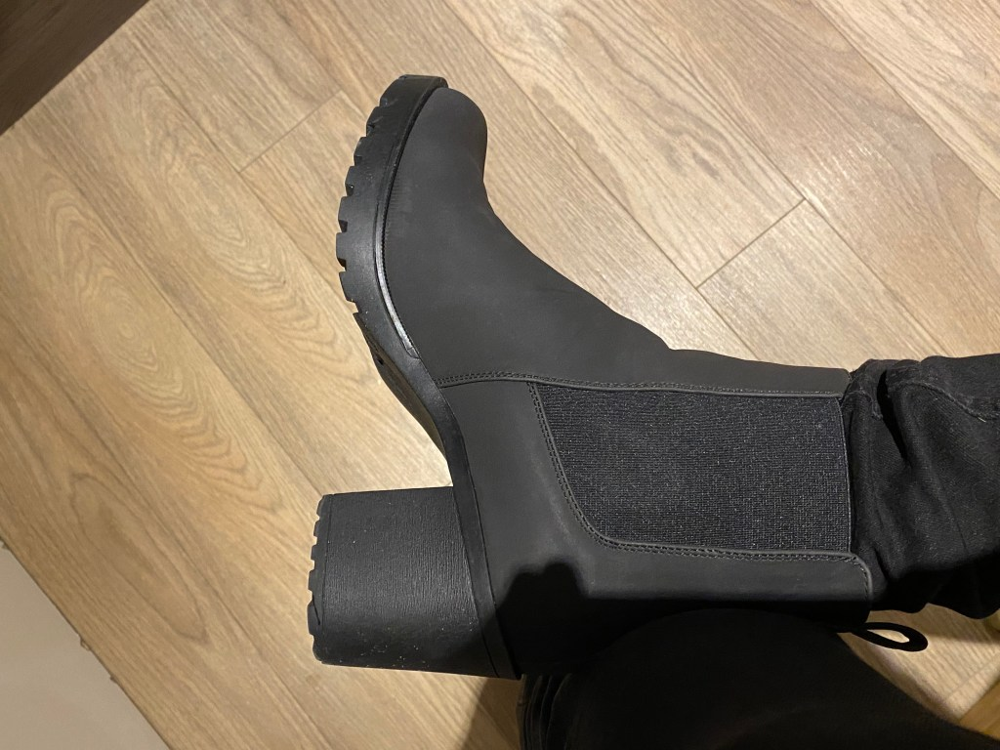
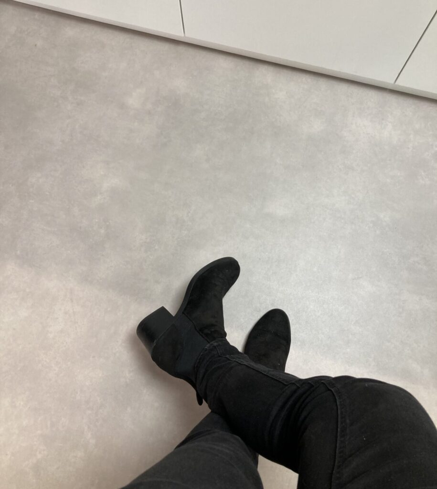
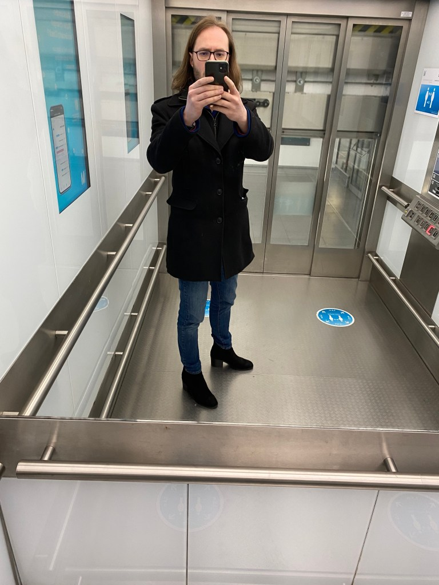
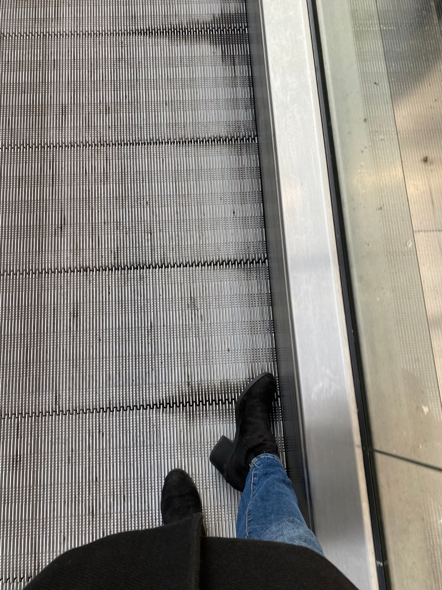
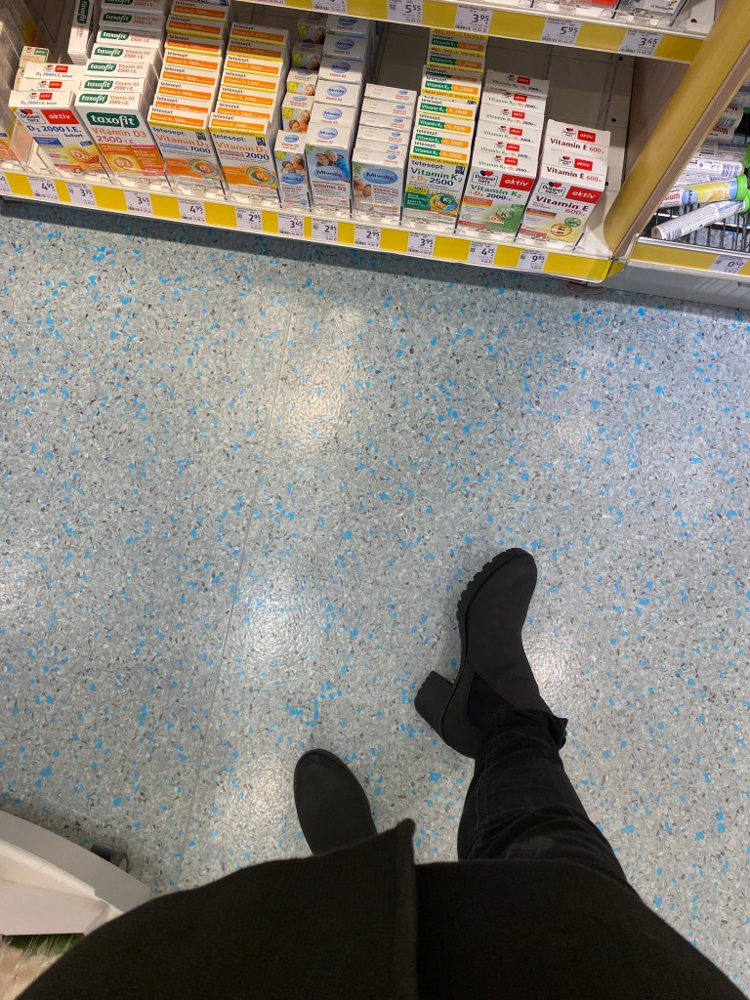
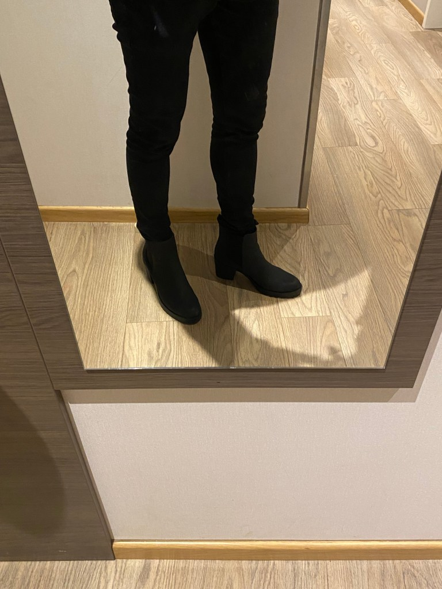

<figure><figcaption>Ich mache mich fertig, um in meinen Absatzstiefeln auszugehen</figcaption></figure>

*Dieser Beitrag wurde erstmals am 27. August 2023 in englischer Sprache auf [The Beskirted Man](https://www.the-beskirted-man.com/personal-experiences/heeled-boots-at-the-office/) veröffentlicht.*

Dieser Beitrag wird ein wenig anders sein als die meisten anderen Beiträge, die ich geschrieben habe, da es darum geht, Absatzschuhe zu tragen anstelle von Röcken. Zwar trage ich in der Regel eher Röcke als Absatzschuhe, aber ich genieße hin und wieder einen Ausflug in Schuhe mit höherem Absatz.

Ich habe angefangen, Absatzschuhe zu tragen, bevor ich überhaupt Röcke trug. Tatsächlich waren sie das Sprungbrett, das mich auf den Weg zu anderer, typisch „femininer“ Kleidung führte. Meistens kombiniere ich sie mit Röcken, aber manchmal trage ich sie auch zu Jeans. Eigentlich [habe ich mir zuerst den Mut zusammengerafft](https://blog.alexseifert.de/2025/05/07/sich-den-mut-zusammennehmen-um-in-die-oeffentlichkeit-zu-gehen/), in der Öffentlichkeit mit Absatzschuhen und Jeans aufzutreten, bevor ich es mit einem Rock wagen konnte.

In der Öffentlichkeit in Absatzschuhen
--------------------------------------

Seitdem ich Absatzschuhe trage, war ich zahlreich in der Öffentlichkeit mit ihnen unterwegs. Mein Favorit sind Stiefel mit einem Blockabsatz, der allerdings nicht übertrieben hoch ist. Nicht nur, dass sie mir wirklich gut stehen, sie bieten auch den Vorteil, ein wenig „maskuliner“ zu wirken und dadurch unauffälliger zu sein. Zwar ist das nicht der Hauptgrund, warum sie meine Favoriten sind, aber es hat mir anfangs geholfen, den Mut aufzubringen, sie das erste Mal in der Öffentlichkeit zu tragen.

Anfangs trug ich sie mehrmals in München. Ich erledigte Besorgungen, ging mit meiner Frau essen und schlenderte einfach so durch die Stadt – so wie ich es normalerweise auch in flachen Schuhen tun würde. Genau wie beim [allerersten Mal in der Öffentlichkeit mit einem Rock](https://blog.alexseifert.de/2025/05/13/mein-erstes-mal-in-der-oeffentlichkeit-in-einem-rock/) schenkte niemand dem Ganzen besondere Beachtung, denn die Leute sind meist zu sehr mit ihren eigenen Angelegenheiten beschäftigt, um darauf zu achten, welche Schuhe man trägt.

Sobald ich mir in ihnen genügend sicher war, entschied ich, dass es an der Zeit war, den nächsten Schritt zu wagen und sie im Büro zu tragen.

Im Büro in Absatzschuhen
------------------------

Das erste Mal, als ich meine Absatzstiefel zur Arbeit trug, war vor dem COVID-Ausbruch, als ich täglich pendelte. Ich trug sie fast zwei Wochen ununterbrochen, bevor schließlich jemand darauf ansprach. Einer der Manager sah meine Schuhe an und meinte in einem freundlichen Ton: „Nur ein Amerikaner kann solche Schuhe tragen.“ Ich bin zwar ein Amerikaner, der in Deutschland lebt, aber bis heute bin ich mir nicht ganz sicher, was er damit meinte.

Die zweite Erfahrung machte ich ein paar Jahre später, vermutlich bedingt durch COVID und die Tatsache, dass wir alle von zu Hause arbeiten mussten. Bis dahin war der schlimmste Teil von COVID vorbei, und wir fanden uns wieder im Büro – diesmal im Rahmen einer Weihnachtsfeier. Natürlich trug ich ein Paar Absatzstiefel, und gegen Ende des Abends, nachdem reichlich Alkohol geflossen war, zeigte ein weiterer Manager auf meine Füße und bemerkte, es sei ironisch, dass einer der größten Mitarbeiter Absatzschuhe trage.

Ich bin 188 cm groß ohne Absätze, sodass er nicht Unrecht hatte, mich zu den größten Mitarbeitern in unserem kleinen Unternehmen zu zählen. Wir standen in einer kleinen Gesprächsrunde zusammen, und natürlich richtete sich der Blick aller unweigerlich auf meine Schuhe. Es freute mich sogar, dass er das ansprach, da es mir die Gelegenheit gab, ausführlich darüber zu sprechen – etwas, was ich sehr gerne tue.

Ich antwortete, dass ich es liebe, Absatzstiefel zu tragen, weil ich finde, dass sie gut aussehen und ich mich in ihnen wohlfühle. Alle zeigten reges Interesse an dem Thema und stellten sogar Fragen. Eine der Frauen, die selbst oft Absatzschuhe trägt, fragte nach meiner Schuhgröße, und als ich ihr antwortete (46 EU), erkundigte sie sich, wo ich sie kaufe. Sie erklärte, dass sie zwar schon viele Absatzschuhe besaß, aber noch nie welche in dieser Größe gesehen habe.

Ich werde nicht auf jede einzelne Frage eingehen, denn ehrlich gesagt erinnere ich mich nicht mehr an alle. Was ich aber in Erinnerung habe, ist das Gefühl der Begeisterung, das mich nach diesem Gespräch erfüllte. Nicht nur erhielt ich unglaublich positives Feedback von den anderen, auch das Gespräch und die Beantwortung ihrer Fragen haben mir große Freude bereitet. Meine Kollegen waren sehr neugierig und aufrichtig interessiert – eine Erfahrung, die ich sowohl beim Tragen von Absatzschuhen als auch beim Tragen von Röcken von den meisten Menschen gemacht habe.

<figure><figcaption>Meine Absatzstiefel im Büro</figcaption></figure>

Einen neuen Job in Absatzschuhen beginnen
-----------------------------------------

Seit dieser Erfahrung habe ich den Job gewechselt und das hatte absolut nichts mit meiner Wahl an Schuhen oder Kleidung zu tun. Als ich meinen neuen Job antrat, trug ich bei kühlerem Wetter in der Öffentlichkeit fast immer meine Absatzstiefel (von denen ich mehrere Paare besitze). Die Erfahrung hat dazu geführt, dass es für mich normal geworden ist, und ich denke gar nicht mehr darüber nach.

Daher entschied ich mich, am ersten Tag meines neuen Jobs ein Paar davon zu tragen. Obwohl ich jetzt vollständig remote arbeite, muss ich gelegentlich in eine andere Stadt reisen, um ins Büro zu gehen. Die ersten paar Tage war es erforderlich, im Büro anwesend zu sein – und genau dort trug ich meine Absatzstiefel.

Der erste Tag war, wie üblich, ein Wirbelwind an Aktivitäten: Leute treffen, Zugang zu allerlei Dingen erhalten und mir wurde gezeigt, was ich zu tun hatte. Ich hatte keine Gelegenheit, auch nur daran zu denken, was ich an meinen Füßen trug. Auch sonst sagte niemand etwas dazu.

Am zweiten Tag jedoch gab es einen Kommentar. Eine der Kolleginnen erzählte mir, dass sie mich am Vortag in den Stiefeln gesehen habe und dass sie sie absolut liebte. Sie wollte alles über sie wissen: Woher ich sie habe, welche Marke sie sind, warum ich Absatzstiefel trage, welche Erfahrungen ich als Mann in Absatzschuhen gemacht habe, ob ich auch andere Arten trage, wie oft ich sie trage, usw. Es stellte sich heraus, dass sie ein riesiger Fan genau jener Art von Stiefeln ist, die ich trage, und sie war begeistert, einen Mann in ihnen zu sehen.

Natürlich beantwortete ich ihre Fragen ehrlich und erzählte ihr dabei auch von all meinen (nach wie vor) ungewöhnlichen Kleidungsentscheidungen, einschließlich der Tatsache, dass ich meist auch Röcke trage. Sie war aufgeregter, als ich je jemanden in Bezug auf das Thema eines Mannes in typischerweise „femininer“ Kleidung gesehen habe – außer in der Gemeinschaft von Männern, die das bereits tun.

Seitdem haben wir mehrere Gespräche darüber geführt, und ich habe ihr sogar die Links zu meinem Blog [The Beskirted Man](https://www.the-beskirted-man.com) sowie zu meinem [Instagram-Account](https://www.instagram.com/thebeskirtedman/) geschickt. Sie leitete beide an ihren Ehemann weiter, den sie offenbar nun dazu zu bringen versucht, sich auch für femininer Kleidungsstile zu öffnen.

Fazit
-----

Obwohl dieser Beitrag ein wenig vom Thema Röcke abgewichen ist, sollte er vor allem zeigen, dass das Tragen unkonventioneller Schuhe oder Kleidung in öffentlichen und halböffentlichen Umgebungen in der Regel nicht so beängstigend ist, wie man es sich anfangs vorstellt.

Aus meiner Erfahrung, in den letzten Jahren regelmäßig in der Öffentlichkeit Absatzschuhe zu tragen, ist mir kein einziger negativer Vorfall begegnet. Die Leute ignorieren einen meistens, nehmen die Schuhwahl nicht wahr oder gehen konstruktiv auf das Thema ein. Jeder, der meine Schuhe kommentiert hat, war ehrlich neugierig und unterstützend.

Es ist immer noch ungewöhnlich, einen Mann in Absatzschuhen oder einem Rock zu sehen – weshalb die Leute oft danach fragen. Es kann zwar ermüdend sein, es immer wieder erklären zu müssen, doch es hilft den anderen, es zu verstehen und zu akzeptieren. Je öfter das geschieht, desto normaler wird es und desto weniger stigmatisiert. Deshalb bin ich geduldig und freue mich sogar, wenn mich Leute darauf ansprechen.

*Trägst du Absatzschuhe? Hast du sie auch schon mal in der Öffentlichkeit getragen? Wie sieht es mit anderer „femininer“ Kleidung wie Röcken aus? Welche Erfahrungen hast du gemacht? Musstest du deine Entscheidungen oft erklären? Lass es mich in den Kommentaren wissen!*

Bildergalerie
-------------

-   <figure><figcaption>Absatzstiefel am Münchner Flughafen</figcaption></figure>
    
-   <figure><figcaption>Absatzstiefel am Münchner Flughafen</figcaption></figure>
    
-   <figure><figcaption>Absatzstiefel in der Drogerie</figcaption></figure>
    
-   <figure><figcaption>Ich mache mich fertig, um in meinen Absatzstiefeln auszugehen</figcaption></figure>
    
-   <figure><figcaption>Ich mache mich fertig, um in meinen Absatzstiefeln auszugehen</figcaption></figure>
    
-   <figure><figcaption>Absatzstiefel vor der Frauenkirche in München</figcaption></figure>
    
-   <figure><figcaption>Meine Absatzstiefel im Büro</figcaption></figure>