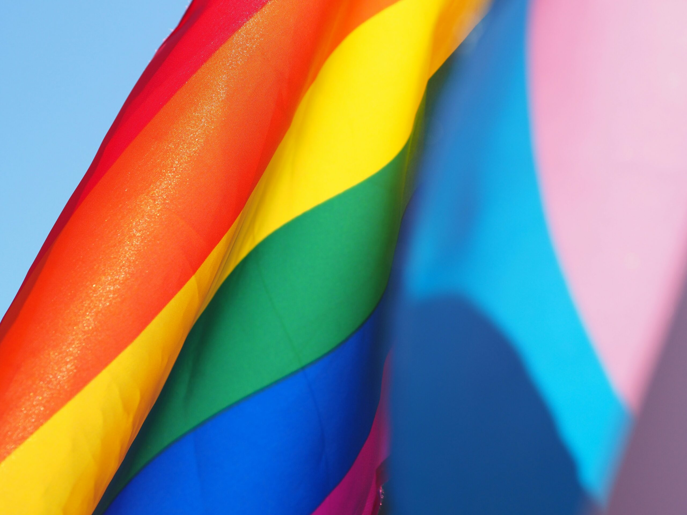

<figure></figure>

*Dieser Beitrag wurde erstmals am 10. August 2025 in englischer Sprache auf [The Beskirted Man](https://www.the-beskirted-man.com/gender/does-wearing-a-skirt-as-a-man-mean-im-gay-or-trans/) veröffentlicht.*

Ich wollte schon seit Längerem einen Beitrag zu diesem Thema schreiben, weil das eine der ersten Fragen ist, die sich viele Männer stellen oder gestellt bekommen, wenn sie ihre Liebe zu Kleidung entdecken, die man normalerweise in der Frauenabteilung findet. Ich habe bereits über meine eigene Erfahrung geschrieben, wie ich [diese Frage von meiner eigenen Mutter beantworten musst](https://www.the-beskirted-man.com/personal-experiences/the-first-time-i-wore-a-skirt-in-front-of-my-parents/)e.

Wenn Männer Röcke, Absätze und Kleider tragen, gibt es häufig eine gesellschaftliche Assoziation mit Queerness. Früher wurde das Tragen von geschlechtsuntypischer Kleidung hauptsächlich mit Homosexualität in Verbindung gebracht, aber in den letzten Jahren ist auch Transgenderismus stärker in den öffentlichen Diskurs geraten. Der US-Verteidigungsminister, Pete Hegseth, bezeichnete Transfrauen sogar kürzlich als „Kerle in Kleidern“ (Englisch: [„dudes in dresses“](https://www.msn.com/en-in/news/world/no-more-dudes-in-dresses-pete-hegseth-after-us-supreme-courts-decision-on-transgender-military-ban/ar-AA1EjslJ)) und bestätigte damit diese Verbindung.

Geschlechtsuntypisches Verhalten und Homosexualität
---------------------------------------------------

Warum also assoziieren so viele Menschen diese beiden Dinge miteinander? Die Antwort liegt in der jahrhundertelangen Tradition, dass schwule Männer Kleidung tragen, die typischerweise mit Frauen assoziiert wird. Für einige ist es ein wesentlicher Teil ihrer queeren Identität. Jede Veranstaltung, die Homosexualität feiert, wie zum Beispiel Pride-Paraden, ist voller Männer, die Absätze, Kleider, Make-up und alle möglichen geschlechtsuntypischen Outfits tragen. Wenn du das noch nie gesehen hast, ist es wirklich wunderschön.

Abgesehen von Veranstaltungen, die den queeren Stolz feiern, gibt es auch die Drag-Szene. Laut [Wikipedia](https://de.wikipedia.org/wiki/Dragqueen) wird eine Dragqueen folgendermaßen definiert:

> Eine Dragqueen ist eine Person (häufig ein Mann), die in künstlerischer oder humoristischer Absicht durch Aussehen und Verhalten eine Frau darstellt.
> 
> [Wikipedia](https://de.wikipedia.org/wiki/Dragqueen)

Die meisten Menschen haben ein Bild von einer Dragqueen mit viel buntem Make-up, einem extravaganten Kostüm und glitzernden Absätzen gesehen. Es ist eine Kunstform, mit der die meisten zumindest vage vertraut sind, aber die Bilder werden auch stark mit Homosexualität assoziiert, unabhängig von der tatsächlichen sexuellen Orientierung der Performer.

In manchen Fällen ist dies sogar das Erste, was den Menschen in den Sinn kommt, wenn sie an geschlechtsuntypisches Verhalten denken, da Bilder davon zumindest halbwegs regelmäßig in den Mainstream- und sozialen Medien auftauchen – egal, ob in positivem oder negativem Licht.

Manche Menschen mit bestimmten politischen Absichten könnten versuchen zu argumentieren, dass all dies ein neues Phänomen sei, das unter anderem durch leicht zugängliche Informationen und Online-Trends entstanden ist, die von ihrer heterosexuellen Norm abweichen. Das stimmt jedoch in keiner Weise.

Egal wie sie es drehen und wenden, seit Jahrhunderten gibt es viele gut dokumentierte Fälle von nicht-heterosexuellen Männern, die geschlechtsuntypische Kleidung tragen. Ein perfektes Beispiel wäre [Philippe I., Herzog von Orléans](https://de.wikipedia.org/wiki/Philippe_I._de_Bourbon,_duc_d’Orléans). Als Bruder des französischen Königs Ludwig XIV., eines der mächtigsten Könige in der französischen Geschichte, befand er sich in einer außergewöhnlich gut dokumentierten und privilegierten Position, um seine Queerness bei Hofe offen zur Schau stellen zu können. [Er trug oft Frauenkleider](https://de-academic.com/dic.nsf/dewiki/1103934) und flirtete mit anderen Männern bei Hofe. Da der Sonnenkönig, wie Ludwig XIV. auch genannt wurde, seinen jüngeren Bruder mochte, mussten diese Männer seine Flirts tolerieren, wenn sie nicht in Ungnade fallen wollten.

Philippe wurde 1640 geboren und starb 1701 – Hunderte von Jahren, bevor irgendjemand, der heute lebt, überhaupt geboren wurde. Aber ich schweife ab. Der Punkt, den ich machen möchte, ist, dass geschlechtsuntypisches Verhalten schon lange mit Queerness und insbesondere mit Homosexualität assoziiert wird.

Geschlechtsuntypisches Verhalten und Transgenderismus
-----------------------------------------------------

Im Gegensatz zur Assoziation von Homosexualität mit geschlechtsuntypischem Verhalten ist das Thema Transgenderismus erst vor kurzem Teil des Mainstream-Diskurses geworden, obwohl es, wie schwule Männer, sie schon immer gab. Daher ist die Assoziation erst eine relativ neue.

Die Beziehung zwischen geschlechtsuntypischem Verhalten und Transgenderismus ist ein viel komplexeres Thema als mit Homosexualität. Das liegt daran, dass wir uns zuerst fragen müssen: Wann trifft das eigentlich zu? Eine Transfrau nimmt offensichtlich nicht an geschlechtsuntypischem Verhalten teil, wenn sie ein Kleid und Absätze trägt, aber was ist vor ihrer Transition? Wenn sie zum Beispiel vor oder während ihrer Transition dasselbe Kleid getragen hat, wann hört es auf, geschlechtsuntypisch zu sein? Oder war es nie geschlechtsuntypisch, obwohl sie ihre wahre Geschlechtsidentität noch nicht entdeckt hatte und sich noch als Mann betrachtete?

Ich vermute, dass es keine richtige Antwort auf diese Fragen gibt, da sie von Person zu Person und ihren individuellen Erfahrungen sehr unterschiedlich ausfallen wird. Einige mögen sagen, Letzteres trifft zu, während andere sagen mögen, dass es beginnt, wenn sie sich öffentlich als Frau „durchgehen“ können, und wieder andere mögen es überhaupt nicht in solch Schwarz-Weiß-Begriffen klassifizieren. Alle diese Ansichten sind gleichermaßen legitim.

Eine Sache, auf die sich Transmenschen und ihre Verbündeten jedoch einigen würden, ist, dass eine Transfrau, die Kleidung aus der Frauenabteilung trägt, und ein Transmann, der Kleidung aus der Männerabteilung trägt, eher geschlechtsbestätigend als geschlechtsuntypisch ist.

Bin ich also schwul oder trans, wenn ich gerne geschlechtsuntypische Kleidung trage?
------------------------------------------------------------------------------------

Nun, die kurze Antwort ist ein klares „vielleicht“. Ich kann diese Frage nicht für dich beantworten, da die Situation jedes Einzelnen anders ist. Was ich dir jedoch sagen kann, ist, dass du nicht automatisch schwul, trans, hetero, cis oder irgendetwas anderes bist, nur weil du gerne einen Rock und Absätze trägst.

Ein Interesse daran zu entdecken, kann ein Hinweis darauf sein, dass du dich mehr als eine Frau denn als ein Mann fühlst und du dich daher auf den Weg machst, [deine wahre Geschlechtsidentität zu entdecken](https://www.the-beskirted-man.com/gender/wearing-skirts-and-heels-made-me-question-my-gender/). Ebenso könnten sie ein Tor zu einer der Schwulenszenen sein, in der du deine Anziehung zu anderen Männern entdeckst. Genauso wahrscheinlich ist es jedoch, dass du einfach nur magst, wie die Kleidung aussieht oder sich anfühlt, oder sogar die „rebellische“ Natur des Tragens davon, aber dich als heterosexueller Cis-Mann wohlfühlst.

Ich wiederhole es noch einmal, weil es wichtig ist: **Kleidung zu tragen macht dich nicht heterosexuell, schwul, trans oder irgendetwas anderes**. Sie kann dir helfen, dich selbst zu entdecken oder dich wohler mit dir selbst zu fühlen, aber du bist immer noch du, egal was du trägst.

Fazit
-----

Am Ende ist dies eine Frage, der sich die meisten von uns Männer, die „Frauenkleidung“ tragen, ausgesetzt sehen, sei es intern oder extern. Es ist bedauerlich und es zeigt, wie ignorant die meisten Menschen in diesem Thema sind.

Es zeigt auch ein Muster, das so repetitiv ist, dass es widerlich ist. Die Gesellschaft mag es nicht, wenn Männer etwas tun, das offensichtlich feminin ist, wie ein Kleid mit Strumpfhosen zu tragen. Es lässt sie zu feminin erscheinen, was bedeutet, zu schwach und nicht „männlich“ genug. Es ist unverhohlene Frauenfeindlichkeit, da alles Weibliche als unterhalb der männlichen Männlichkeit abgetan wird. Stattdessen, mit der langen Assoziation von geschlechtsuntypischem Verhalten mit Homosexualität, ist es für diejenigen, die nicht zu viel geistiger Anstrengung neigen, einfacher, schnell die Verbindung zu Queerness herzustellen und den geschlechtsuntypischen Mann in eine regenbogenfarbene Kiste zu stecken und dabei die geistige Arbeit für den Tag zu beenden.

Die Gefahr hierbei ist jedoch, dass du dich selbst einreden lässt, etwas zu sein, was du nicht bist. Ich spreche aus meiner eigenen Erfahrung, da ich eine lange, schwierige Phase durchgemacht habe, in der [ich meine eigene Geschlechtsidentität infrage stellte](https://www.the-beskirted-man.com/gender/wearing-skirts-and-heels-made-me-question-my-gender/) und beinahe meine Frau verloren hätte.

Es gibt noch eine letzte Sache, die ich erwähnen möchte, bevor ich zum Abschluss komme. Obwohl ich weder homosexuell noch trans bin, ist es sicherlich eine Ehre, mit einer so wunderbaren Gruppe von Menschen assoziiert zu werden, die mutig genug sind, sie selbst zu sein, angesichts von so viel Diskriminierung und Ächtung. Während ich mich also nicht wirklich als Teil der queeren Szene betrachte, sehe ich mich definitiv als Verbündeten.

Geschlechtsuntypische Kleidung zu tragen bedeutet **nicht**, dass du etwas bist, was du nicht warst, bevor du die Kleidung angezogen hast. Es kann dich dazu führen, zu entdecken, dass du schwul oder transgender bist, aber es ist genauso wahrscheinlich, dass du den Rock oder das Kleid anziehst, weil du es einfach gerne trägst. Lass dich nicht von anderen oder von der Gesellschaft im Allgemeinen unter Druck setzen, zu denken, dass du etwas bist, was du nicht bist. Bleib dir selbst treu, unabhängig von deinem Geschlecht oder deiner sexuellen Orientierung, und genieß die wunderbare Freiheit, die mit dem Tragen von Kleidung aus der Männer- und der Frauenabteilung einhergeht!

*Was sind deine Erfahrungen? Wurdest du jemals gefragt oder hast du dich selbst gefragt, ob du schwul oder transgender bist, nur wegen Ihrer Kleiderwahl? Lass es mich in den Kommentaren wissen!*