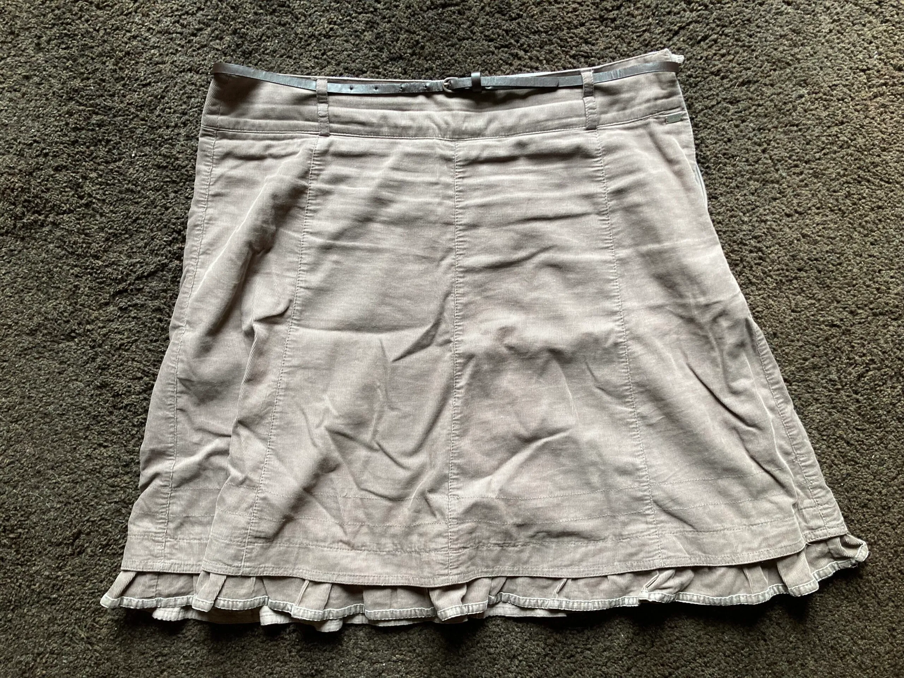
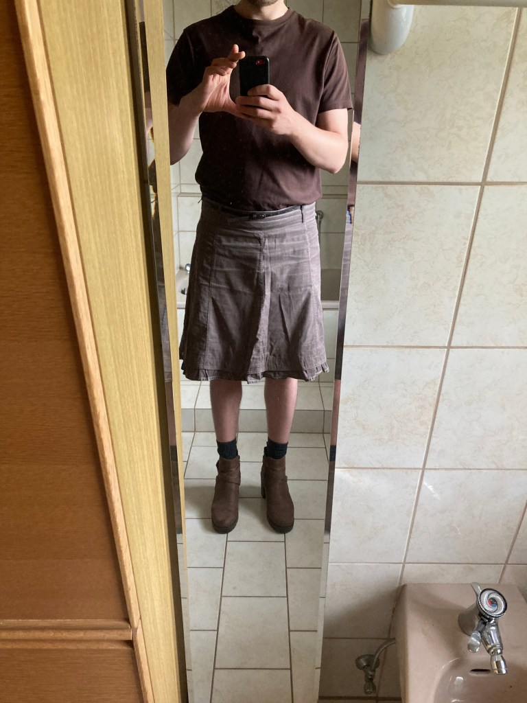
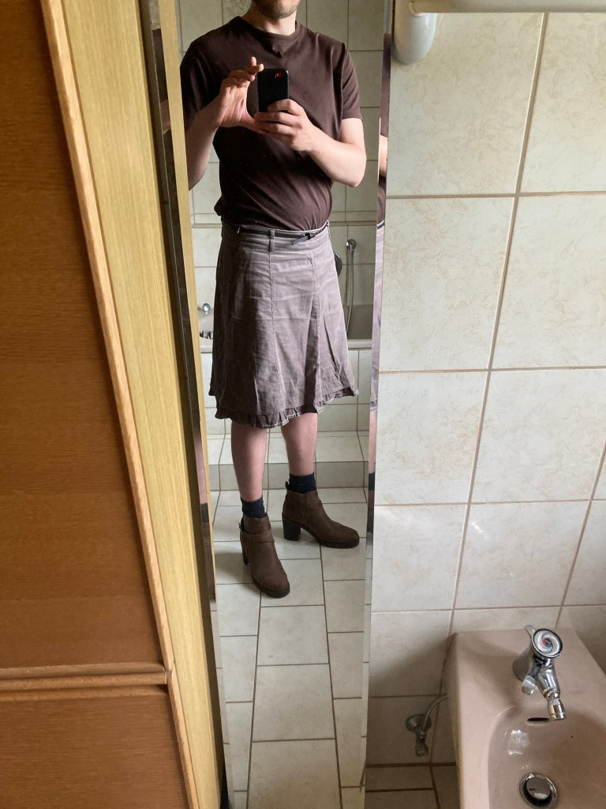

<figure><figcaption>Der Rock, den ich zum ersten mal in der Öffentlichkeit trug</figcaption></figure>

*Dieser Beitrag wurde erstmals am 23. Juli 2023 in englischer Sprache auf [The Beskirted Man](https://www.the-beskirted-man.com/personal-experiences/my-first-time-in-public-in-a-skirt/) veröffentlicht.*

Das erste Mal in der Öffentlichkeit in einem Rock kann für jeden Mann eine erschütternde Erfahrung sein. Die weit verbreitete Meinung in der westlichen Gesellschaft, dass nur Frauen Röcke tragen sollten, hindert viele Männer daran, eines ihrer Lieblingskleidungsstücke zu tragen. Sie fürchten verurteilende Blicke oder –- noch schlimmer –- Belästigungen.

Aus diesem Grund dachte ich, es wäre nützlich, über mein erstes Mal zu schreiben, in dem ich in der Öffentlichkeit einen Rock trug. Ich werde berichten, was es für mich bedeutete, die anfängliche Hürde zu überwinden, das Haus zu verlassen, sowie meine Erfahrungen in großen Menschenmengen, in Zügen, Geschäften, Restaurants usw. Ein kleines Vorwort: Es lief alles extrem gut!

Die anfängliche Hürde überwinden
--------------------------------

Die anfängliche Hürde, das Haus in einem Rock zu verlassen, zu überwinden, ist bei weitem der schwierigste Teil. Als ich das erste Mal in der Öffentlichkeit in einem Rock unterwegs war, benötigte ich die Unterstützung einer Gruppe, um über meine Selbstzweifel hinwegzukommen, obwohl mich meine Frau bereits seit Wochen unermüdlich ermutigt hatte, es endlich zu wagen.

Trotzdem brauchte es einen Besuch meiner Schwester und ihres Ehemanns, damit ich endlich den Sprung wagte. Beide kannten seit einiger Zeit meine Vorliebe für Röcke und drängten mich ständig, endlich einmal einen Rock in der Öffentlichkeit zu tragen.

Eines Tages unternahmen wir einen Tagesausflug in Regensburg. Meine Frau, meine Schwester und ihr Ehemann drängten mich immer wieder, einen Rock zu tragen –- und so tat ich es. Ich zog den grauen Rock an, wie auf dem oben gezeigten Bild, und war den ganzen Morgen ein Nervenbündel, bis wir unseren Zug erwischen mussten.

Der erste Schritt nach draußen war zugleich erschreckend und befreiend. Sobald wir die Straße hinunter zum Zug gingen, vorbei an unseren Nachbarn und einer belebten Baustelle, wurde mir klar, dass nichts passieren würde. Ich war draußen in einem Rock und noch immer am Leben. Niemand schenkte mir wirklich Beachtung und wer hinsah, tat dies nur kurz –- sie kümmerten sich einfach nicht darum.

Dieser Moment war entscheidend für mich. Davor war ich in ständiger Alarmbereitschaft, als könnte jederzeit jemand auf mich losgehen. Natürlich passierte das nicht. Überhaupt nichts passierte. In diesem Moment konnte ich mich etwas entspannen. Auch wenn ich den ganzen Tag noch nervös war, war ich nicht länger vor Angst gelähmt und konnte das Erlebnis in vollen Zügen genießen.

Unterwegs
---------

Das Erlebnis, zum ersten Mal in einem Rock unterwegs zu sein, werde ich nie vergessen. Mein Körper war voller Adrenalin und dennoch empfand ich eine zen-artige Ruhe. Es ist schwer, es anders zu beschreiben –- es war zugleich beängstigend und unglaublich befreiend. Ich vermute, dass Extremsportler ein ähnliches Gefühl erleben, wenn sie Klippenspringen oder Fallschirmspringen betreiben.

Die Zugfahrt nach Regensburg verlief völlig ereignislos. Der Schaffner kontrollierte unsere Tickets, ohne auch nur einen Augenaufschlag zu riskieren, als er bemerkte, dass ich einen Rock trug. Andere Fahrgäste warfen einen Blick auf mich, als ich in den Zug stieg und diesen wieder verließ, aber niemand starrte oder zeigte großes Interesse an meinem Outfit.

Einmal in Regensburg, schlenderten wir den ganzen Tag über durch die Altstadt. Es war ein warmer, sonniger Tag und die alten, engen Gassen waren voller Menschen. Ich bemerkte hier und da ein paar Blicke, doch meist schenkte man mir nicht einmal Beachtung. Während ich durch die Stadt ging, waren die Leute in Gedanken vertieft, in Gruppen beschäftigt oder in Aktivitäten eingebunden und sie kümmerten sich einfach nicht darum, was ich trug.

Am Abend gingen wir zum Abendessen und auch dort störte ein Mann im Rock niemanden. Selbst als ich die Herrentoilette benutzte, reagierten die anderen Männer nicht. Da ich einen Rock trug, musste ich eine Kabine anstelle des Urinals benutzen, was jedoch keine Rolle spielte.

Reaktionen
----------

Wir waren den ganzen Tag in Regensburg unterwegs und es fielen uns lediglich zwei Bemerkungen auf, von denen eine meiner Frau nur so vorkam, als hätte sie sie wirklich gehört.

Der erste Kommentar kam von der Besitzerin eines kleinen, alternativen Bekleidungsgeschäfts, in das wir hineingingen. Sie lobte meinen Rock und strahlte dabei, was mich wunderbar fühlen ließ. Sie meinte, es sei großartig, dass immer mehr Männer Alternativen zu karierten Hemden und Shorts ausprobieren. Leider hatte sie nicht viel Zeit für ein längeres Gespräch, aber es war schön, einige Minuten über dieses Thema mit ihr zu sprechen.

Der zweite Kommentar fiel auf der Straße, als wir uns in einer großen Menschenmenge befanden. Ein älteres Paar ging vorbei und schaute mich an. Meine Frau meinte, sie habe die Frau leise zu ihrem Mann sagen gehört: „Was sich die jungen Leute heutzutage alles erlauben!“ Als sie mir das erzählte, musste ich lachen. In meinen Dreißigern wird man normalerweise nicht mehr zu dieser Gruppe gezählt.

Das war es aber auch. Niemand starrte, niemand machte weitere Kommentare – absolut nichts veränderte sich. Der erste Kommentar gab mir das Gefühl, im Recht zu sein und glücklich zu werden, während mich der zweite Kommentar zum Lachen brachte. Ich kann nur wiederholen, wie fantastisch die Zeit war, und dass die Reaktionen, die ich erhielt, unterhaltsam und amüsant waren. Sie bereicherten das Erlebnis, anstatt es zu schmälern.

Fazit
-----

Sobald ich draußen war und merkte, dass nichts passieren würde, begann ich, es wirklich zu genießen. Das Erlebnis, draußen in einem Rock zu gehen, war äußerst befreiend, da es sich so anfühlte, als wäre ein Teil von mir, der so lange verschlossen war, endlich befreit worden. Von diesem Moment an war das Geheimnis gelüftet und ich wusste, dass ich es wieder tun würde.

Seitdem bin ich mehrmals in der Öffentlichkeit in einem Rock aufgetreten –- mehr als man zählen könnte – und ich habe das Erlebnis stets genossen. Manchmal muss ich immer noch die anfängliche Hürde überwinden, das „Sicherheitsgefühl“ des Hauses zu verlassen, aber mit der Übung wird es einfacher.

Ich möchte jeden Mann ermutigen, der daran interessiert ist, in der Öffentlichkeit einen Rock zu tragen, es ebenfalls zu versuchen. Falls es Unterstützung von vertrauten Personen benötigt, suche dir diese Leute, damit sie dich ermutigen und/oder dich begleiten. Das Ausgehen in einer Gruppe, in der man sich sicher fühlt, kann deinem Selbstvertrauen einen enormen Schub verleihen und den Schritt ins öffentliche Leben erleichtern.

Sobald du den ersten Schritt gewagt hast, wird es beim zweiten, dritten, vierten Mal usw. exponentiell leichter, bis du es irgendwann fast automatisch tust.

*Wie war dein erstes Mal in der Öffentlichkeit in einem Rock? Hattest du Unterstützung von vertrauten Personen oder hätte sie dir geholfen? Erzähle es uns in den Kommentaren!*

Die unten stehenden Fotos zeigen mich in dem ersten Rock, den ich in der Öffentlichkeit trug, allerdings zu einem späteren Zeitpunkt. Das Outfit sah ähnlich aus, aber ich trug flache Sneakers statt Absatzstiefeln und ein schwarzes T-Shirt anstelle eines braunen.

-   <figure><figcaption>Der Rock, den ich zum ersten mal in der Öffentlichkeit trug</figcaption></figure>
    
-   <figure><figcaption>Der Rock, den ich zum ersten mal in der Öffentlichkeit trug</figcaption></figure>