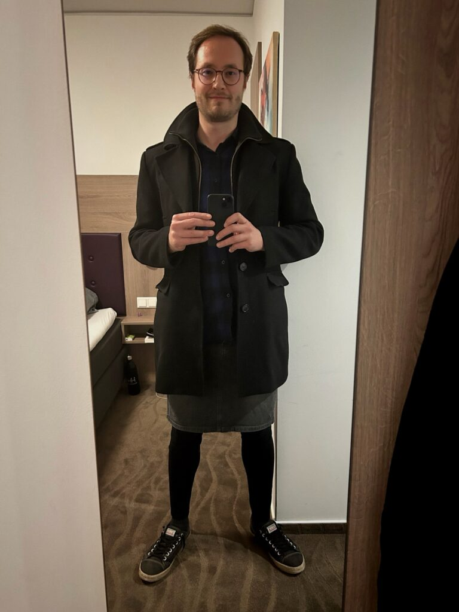
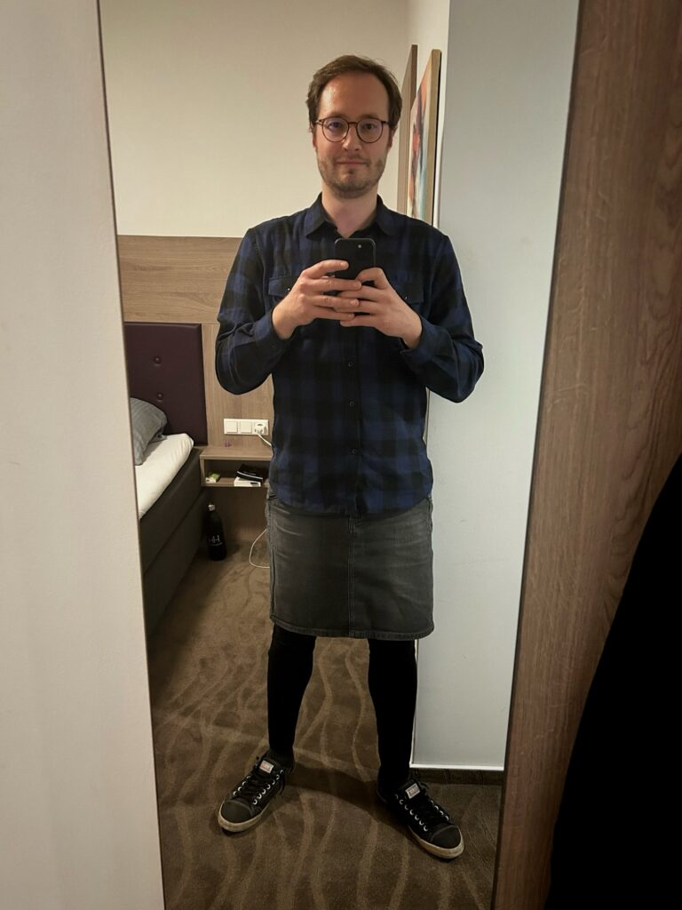

<figure></figure>

<figure></figure>

*Dieser Beitrag wurde erstmals am 27. Oktober 2024 in englischer Sprache auf [The Beskirted Man](https://www.the-beskirted-man.com/in-public/my-first-time-wearing-a-skirt-to-the-office/) veröffentlicht.*

Wie diejenigen unter euch, die mir auf [Instagram](https://www.instagram.com/p/DBeo4GTuNTN/) folgen, wahrscheinlich schon gesehen haben, habe ich am 23. Oktober 2024 zum allerersten Mal einen Rock ins Büro getragen. Die Fotos oben zeigen das Outfit, das ich an diesem Tag getragen habe, und wurden anschließend im Hotel aufgenommen. Ich arbeite hauptsächlich remote, weil das Büro etwa 200 km von meinem Wohnort entfernt ist, was bedeutet, dass ich nur selten dort bin.

Ich habe schon früher darüber geschrieben, dass [ich im Büro Stiefel mit Absatz getragen habe](https://blog.alexseifert.de/2025/06/23/absatzstiefel-im-buero/), aber tatsächlich hatte ich noch nie einen Rock getragen, was deutlich weniger subtil ist. Da ich das Büro vielleicht zweimal im Jahr besuche, habe ich nicht viele Gelegenheiten dazu, und wenn ich dort war, fühlte ich mich nie ganz wohl dabei, einen Rock zu tragen, weil ich die Leute nicht besonders gut kenne. Alle, mit denen ich täglich zusammenarbeite, arbeiten ebenfalls remote, sodass die meisten der regelmäßigen Büroangestellten für mich unbekannte Gesichter sind.

Diesmal war es jedoch anders. Auch wenn ich immer noch niemanden wirklich kannte, war ich dort, um an einem Schulungsseminar für Softwarearchitektur teilzunehmen, wodurch ich die Gruppe, mit der ich zusammen war, schon nach ein paar Tagen recht gut kennengelernt hatte. Am Mittwoch entschied ich, dass ich mich wohl genug fühlte, um meinen grauen Jeansrock und schwarze Baumwollleggings herauszuholen, wie man auf den Bildern oben sehen kann.

Es versteht sich von selbst, dass ich unglaublich nervös war, trotz all meiner Erfahrung damit, Röcke in der Öffentlichkeit zu tragen, denn dies war eine Situation, in der mein Arbeitgeber und meine Kollegen involviert waren – nicht irgendwelche zufälligen Menschen auf der Straße. Als ich mein Hotelzimmer verließ, ging ich hinunter in den Frühstücksraum, wo ich auf ein paar andere Teilnehmer des Seminars traf, die ebenfalls remote arbeiten. Ich holte mir mein Frühstück, setzte mich und unterhielt mich beim Essen mit ihnen. Kein einziges Wort wurde über meine Kleiderwahl verloren, was mir half, mich zu entspannen.

Anschließend fuhren wir gemeinsam zum Bürogebäude. Drinnen gingen wir die Treppe hinauf in den vierten Stock, wo sich das Büro befindet. Obwohl einige aus der Gruppe hinter mir liefen und unmöglich übersehen konnten, dass ich einen Rock trug, sagte niemand etwas, und absolut nichts änderte sich in unseren Interaktionen.

Im Büro gingen wir in den Konferenzraum, in dem das Seminar stattfand. Der Dozent war bereits da, ebenso wie der Rest der Gruppe. Die Leute sahen mich und die anderen an, als wir den Raum betraten, aber genau so, wie sie es getan hätten, wenn ich Jeans getragen hätte.

Für die meisten von euch, die schon von meinen Erfahrungen mit Röcken in der Öffentlichkeit gelesen haben, wird es keine Überraschung sein, dass kein einziger Mensch meinen Rock erwähnte oder mich den ganzen Tag über anders behandelte. Es war exakt so, als hätte ich irgendeine Hose aus der Herrenabteilung getragen.

Die einzigen merkwürdigen Blicke bekam ich von ein paar älteren Damen im Restaurant, in dem wir zu Mittag aßen. Sie starrten mich sehr offen an und flüsterten miteinander – eine Situation, die mich eher amüsiert, da sie vermutlich noch nie zuvor einen Mann im Rock gesehen hatten.

Nach einem langen Tag im Büro fuhr ich mit meinen Kollegen zurück ins Hotel und wir gingen für ein paar Stunden getrennte Wege, bis wir beschlossen, uns zum Abendessen zu treffen. Ich blieb in meinem Rock, und wir hatten ein großartiges Essen in einem vietnamesischen Restaurant, zu dem wir zu Fuß über eine gut befahrene Straße gelangten. Wieder passierte absolut nichts.

Mein Rock wurde kein einziges Mal erwähnt. Niemand sah mich seltsam an, niemand behandelte mich anders, und alle waren genauso freundlich und professionell wie zuvor. Tatsächlich waren sie viel mehr daran interessiert, dass ich Amerikaner bin, was viele Deutsche zu faszinieren scheint, da ich ziemlich gut Deutsch spreche.

Alles in allem war die Erfahrung genau so, wie ich es erwartet hatte: völlig unspektakulär. Niemand kümmert sich darum, was man trägt, solange es zum Kontext passt. Trotz alldem würde ich wahrscheinlich keinen Rock tragen, wenn ich einen Kunden meines Unternehmens besuche, da dies leider immer noch indirekte Auswirkungen auf meine Firma haben könnte. Aber wenn ich das Büro in Zukunft wieder besuche, werde ich ganz sicher wieder einen Rock tragen.