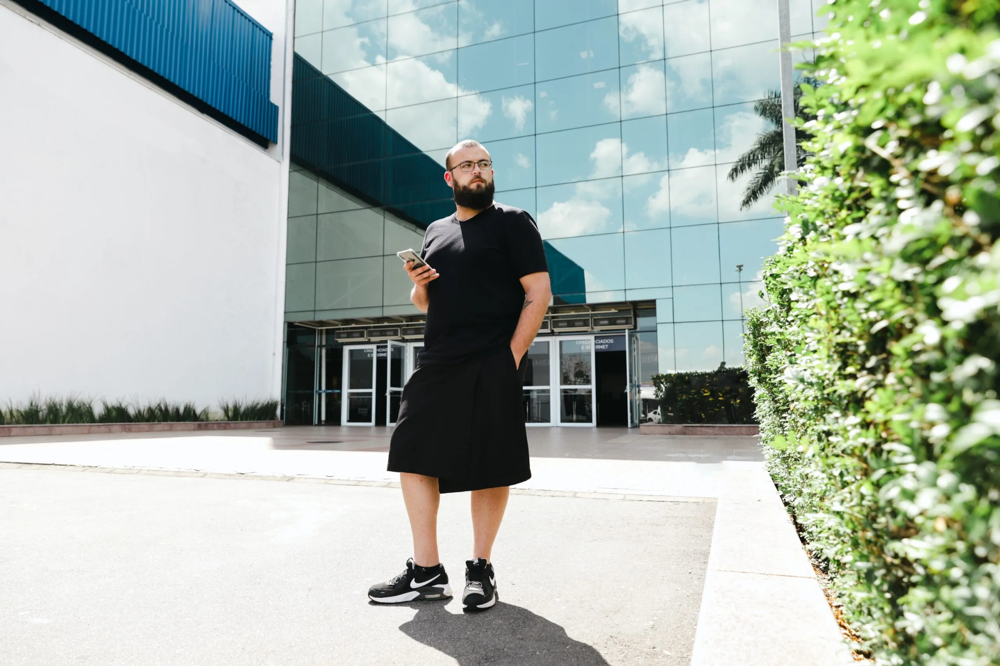

<figure></figure>

*Dieser Beitrag wurde erstmals am 7. April 2023 in englischer Sprache auf [The Beskirted Man](https://www.the-beskirted-man.com/in-public/building-up-the-courage-to-go-out-in-public/) veröffentlicht.*

Als Mann in der Öffentlichkeit einen Rock, ein Kleid, High Heels oder andere Kleidungsstücke zu tragen, die von der westlichen Gesellschaft üblicherweise als Damenbekleidung gelten, erfordert ein gewisses Maß an Selbstvertrauen, rebellischer Haltung und Unabhängigkeit. Für viele Männer ist das undenkbar, selbst wenn sie es genießen, solche Kleidung zu Hause zu tragen und es sehr gerne auch außerhalb tun würden.

Der Mut, diese Kleidung in der Öffentlichkeit zu tragen, lässt sich im Grunde auf einen Punkt reduzieren: *Selbstvertrauen*. Du musst selbstbewusst und komfortabel darin sein, sie zu tragen, um es zu schaffen. Das erfordert Übung, aber es hilft auch, wenn du dich auf die Reaktionen aus der Öffentlichkeit eingestellt hast.

Reaktionen
----------

Die ersten Male, wenn du das Haus verlässt, sind meist schwierig, weil die meisten von uns ein tief verwurzeltes Bedürfnis nach der Zustimmung anderer haben und Angst vor negativen Reaktionen besitzen. Gegen den Strom zu schwimmen, bringt in der Regel nicht die Zustimmung, die wir uns wünschen.

Doch sobald du draußen bist, lässt jede Nervosität allmählich nach, weil du merkst, dass dir nichts passieren wird. Anfangs hast du vielleicht das Bedürfnis, dich in den dunklen Schatten zu verstecken, damit dich niemand sieht – in Wirklichkeit schenken die meisten Menschen dem aber gar keine Beachtung.

Von den wenigen, die es bemerken, kümmern sich die meisten nicht genug, um etwas zu sagen oder zu tun. Sie werfen vielleicht einen kurzen Blick zurück oder heben die Augenbrauen – genauso wie, wenn du einen Clownsanzug tragen würdest: Sie reagieren einfach, weil sie überrascht sind, etwas Ungewöhnliches zu sehen.

Sollte jedoch jemand etwas sagen, fällt dies in der Regel positiv aus. Meiner Erfahrung nach haben mir Frauen bereits Komplimente für mein Outfit und meinen Mut, High Heels oder einen Rock in der Öffentlichkeit zu tragen, gemacht. Bisher kam jedes Kompliment von einer Frau. Ich glaube nicht, dass Männer generell negativer darüber denken – vielmehr wurden sie dazu erzogen, zu glauben, dass es „schwul“ oder anderer Unsinn ist, wenn man einem anderen Mann sein Outfit lobt. Denk nur daran, wie Jungen in der Grundschule miteinander umgingen – sie würden selbst einem typischen, scharf geschnittenen, hypermaskulinen, maßgeschneiderten Anzug kein Kompliment machen.

Leider gibt es auch immer wieder Einzelne, die meinen, dir vorschreiben zu müssen, wie du dich (nicht) kleiden sollst. Diese Personen könnten dich beleidigen oder fragen, ob du versuchst, eine Frau zu sein – was entweder Ausdruck ihrer eigenen Unsicherheit oder ein grober Versuch ist, das Gesehene zu verstehen.

Um mit negativen Reaktionen umzugehen, ist es wichtig, zu verstehen, woher die jeweilige Person kommt und warum sie negativ reagiert. Meiner Erfahrung nach fallen solche Reaktionen in zwei Kategorien: Entweder sind die Personen unsicher oder sie sind völlig verwirrt. Viele Männer wirken äußerlich überaus selbstbewusst, sind jedoch in ihrer Männlichkeit insgeheim unsicher. Diese Typen fühlen sich oft angegriffen, wenn du selbstbewusst in „femininer“ Kleidung auftauchst, und sie sehen sich gezwungen, etwas zu sagen, um die Lücke in ihrer vermeintlichen Männlichkeit zu stopfen – insbesondere, wenn sie in einer Gruppe von Freunden sind und sich beweisen möchten.

Der Anblick eines Mannes in nicht genderkonformer Kleidung erscheint vielen Menschen völlig fremd. Wenn sie dann dumme Fragen stellen, wie etwa „Versuchst du, eine Frau zu sein?“, ist das einfach ihr Weg, zu verstehen, was sie sehen. Man könnte es als vorübergehende Fehlfunktion des höflicheren Teils ihres Gehirns deuten, während sie versuchen, das Gesehene zu verarbeiten. Einige mögen es böswillig meinen, aber meist handelt es sich um Unsicherheit. Die meisten, die derartige Fragen stellen, sind schlichtweg zu überrascht, um überhaupt zu merken, was sie tun. In solchen Fällen hilft eine geduldige und selbstbewusste Erklärung oft sehr weiter.

Selbstvertrauen ist der Schlüssel
---------------------------------

Wie bereits erwähnt, ist Selbstvertrauen unerlässlich, um in der Öffentlichkeit etwas Ungewöhnliches zu tragen und es gut aussehen zu lassen – sei es ein Kleid oder ein Clownsanzug. Es gibt genügend Menschen, denen es an dem Mut fehlt, einen Clownsanzug in der Öffentlichkeit zu tragen. Wenn du dir darüber im Klaren bist, warum du es genießt, solche Kleidung zu tragen, wirst du dich deutlich selbstsicherer fühlen. Das hilft dir nicht nur, dich selbst besser zu verstehen und etwaige Unsicherheiten auszumerzen, sondern gibt dir auch eine fertige Antwort, wenn jemand unweigerlich das gefürchtete „Warum?“ stellt.

Übung ist ebenfalls entscheidend. Zunächst solltest du die Kleidung zu Hause tragen, um ein Gefühl dafür zu bekommen. Gewöhne dich an dein eigenes Erscheinungsbild in diesen Outfits und experimentiere damit, was dir gut steht, bevor du dich in der Öffentlichkeit zeigst – schließlich ist das ein Stilwechsel.

Wenn du das schon eine Weile tust und bereit bist, den Schritt ins öffentliche Rampenlicht zu wagen, schlage ich vor, dich langsam heranzutasten, indem du hybride Outfits ausprobierst. Fang mit etwas Männlichem an, wie zum Beispiel einem Kilt. Vielleicht wirfst du noch vereinzelt einen seitlichen Blick auf dich, aber das liegt dann nicht daran, dass du üblicherweise mit Frauen assoziierte Kleidung trägst.

Danach kannst du zu Röcken in Kombination mit einem maskulinen Hemd übergehen, bevor du dich schließlich an Kleidern versuchst. Führe allmählich mehr und größere Elemente aus deiner feminineren Garderobe ein, anstatt beim ersten Mal gleich alles zu zeigen.

Wenn du den Mut fassen möchtest, in High Heels nach draußen zu gehen, beginne mit niedrigeren und maskulineren Modellen – greife nicht gleich zu den 15 cm-Stiletto-Sandalen, die wir alle lieben. Entscheide dich stattdessen für niedrige, klobige Absätze. Viele dieser Modelle besitzen sogar eine weichere, geräuschlose Absatzkonstruktion, sodass sie nicht so sehr auffallen wie das Klackern herkömmlicher High Heels. Chelsea-Boots oder jede Art von kurzem Stiefel sind ebenfalls ein guter Einstieg, da sie nicht so offensichtlich feminin wirken. Wie bei Röcken und Kleidern solltest du dich langsam zu deinem femininsten Paar High Heels hocharbeiten.

Integriere all diese Elemente in Outfits, mit denen du zufrieden bist. Wenn du in den Spiegel schauen und stolz darauf sein kannst, was du trägst, ist das ein enormer Selbstvertrauensschub! Das erfordert zwar etwas Experimentierfreude, aber letztlich wirst du Kombinationen entdecken, die zu dir passen.

Eine weitere Möglichkeit, dein Selbstvertrauen zu stärken, besteht darin, mit Gleichgesinnten zu sprechen. Es gibt zahlreiche [Foren](https://www.the-beskirted-man.com/links/) und Treffen von Männern, die es genießen, nicht genderkonforme Kleidung zu tragen – viele von ihnen sind bereits erfahren darin, dies in der Öffentlichkeit zu tun. Nichts motiviert so sehr wie die Unterstützung einer Gruppe und der Austausch über die Erfahrungen anderer!

Fazit
-----

Als ich begann, diesen Artikel zu schreiben, hatte ich nicht vor, so viele Anspielungen auf Clownsanzüge einzubauen, aber je länger ich darüber nachdachte, desto mehr wurde mir klar, dass das Tragen eines Clownsanzugs in der Öffentlichkeit gar nicht so anders ist, als einen Rock oder High Heels als Mann zu tragen: Es erfordert eine gesunde Portion Selbstvertrauen und hinterlässt bei den Menschen einen bleibenden Eindruck.

Natürlich will ich nicht sagen, dass Röcke oder Kleider in irgendeiner Weise mit Clownsanzügen vergleichbar sind. Für mich zählt, was es von einer Person erfordert, in der Öffentlichkeit etwas zu tragen, das von der Norm abweicht. Andererseits sind Clownsanzüge sehr bunt und auffällig und ziehen deshalb weitaus mehr Aufmerksamkeit auf sich als ein gut abgestimmtes Outfit – zum Beispiel ein Rock. Ich überlasse es dir, zu beurteilen, was schwieriger umzusetzen ist.

Letztlich läuft alles darauf hinaus, selbstbewusst zu sein – sich auf die Reaktionen anderer vorzubereiten, die eigene Motivation zu verstehen, zu üben und mit dem eigenen Outfit zufrieden zu sein. Je mehr du dich in der öffentlichen Sphäre bewegst und dich mit der Gemeinschaft gleichgesinnter Männer – sowohl online als auch vor Ort – austauschst, desto leichter wird es dir fallen. Irgendwann wirst du dich sogar fragen, warum du überhaupt gezögert hast.

*Bist du jemals in der Öffentlichkeit in einem Rock, Kleid, High Heels oder einem anderen typischerweise femininen Kleidungsstück aufgetreten? Was waren deine Erfahrungen? Wie hast du den Mut aufgebracht, es zu tun? Lass es mich in den Kommentaren unten wissen!*