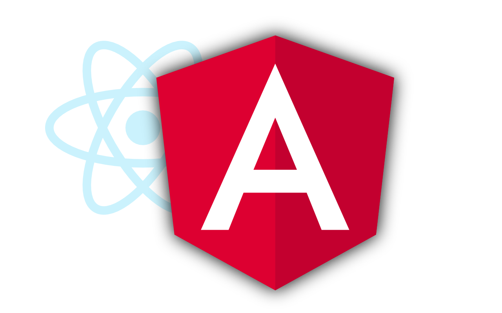

<figure></figure>

*Dieser Beitrag wurde erstmals am 22. Oktober 2023 in englischer Sprache auf *[Alex’s Notebook](https://blog.alexseifert.com/2023/10/22/why-ive-switched-from-react-to-angular-for-my-projects/)* veröffentlicht.*

Seit Jahren war React mein bevorzugtes Frontend-Framework. Ich habe es ab etwa 2015 beruflich verwendet, sodass es auch für meine persönlichen Projekte eine natürliche Wahl war, da ich bereits in dieser Denkweise arbeitete.

Natürlich habe ich seitdem auch mit anderen Frameworks experimentiert, vor allem mit Vue, aber diese haben nie wirklich Bestand gehabt. Am Ende bin ich immer wieder zu React zurückgekehrt für jedes Projekt, das ich umsetzen wollte.

Warum also sollte ich plötzlich anfangen, Angular zu verwenden, wenn sonst nichts wirklich überzeugen konnte?

*Hinweis: Ich weiß, dass einige Entwickler React eher als Bibliothek als Framework bezeichnen. Das mag genauer sein, aber in diesem Artikel werde ich weiterhin von einem Framework sprechen, denn wenn ich „React“ sage, meine ich das gesamte Ökosystem und nicht nur React selbst.*

Ein neuer Job
-------------

Anfang dieses Jahres habe ich einen neuen Job begonnen. Ich wurde als Frontend-Entwickler eingestellt, aber das Projekt forderte den Einsatz von Angular anstelle von React. Als ich mich für die Stelle bewarb, dachte ich, es wäre eine gute Gelegenheit, ein anderes Framework wirklich auszuprobieren, um zu sehen, wie es funktioniert, aussieht und sich anfühlt. Was ich dabei entdeckte, hat mich umgehauen.

Ich weiß, dass Angular nicht das populärste Framework unter Entwicklern ist und besonders nicht unter Frontend-Entwicklern. Ich bin mir ziemlich sicher, dass das daran liegt, dass es einen dazu zwingt, viel mehr wie ein Backend-Entwickler zu denken als Frameworks wie React oder Vue.

Angular ist ein stark opinionated, objektorientiertes Framework, bei dem man in Begriffen wie Klassen (nicht im CSS-Sinne!), Services, Komponenten und Modulen denken muss. React und Vue bieten deutlich mehr Flexibilität beim Zusammenstellen von Komponenten und beim Strukturieren des Codes. Beide haben ihre Vor- und Nachteile, aber als Full-Stack-Entwickler gefällt es mir, objektorientierten Code schreiben zu müssen.

Warum Angular?
--------------

Nachdem ich Angular nun seit mehreren Monaten professionell einsetze, bin ich zu dem Schluss gekommen, dass React in vielerlei Hinsicht einfach nicht mit Angular mithalten kann. Ich werde die Gründe hier in keiner besonderen Reihenfolge zusammenfassen.

### Services

Ich liebe die Services in Angular. Sie sind der Hauptansatz zur Datenverarbeitung, sind einfach, intuitiv, leicht unit-testbar und ideal für den Umgang mit großen Datenmengen.

Wie funktionieren sie in Angular? Ich werde nicht zu sehr ins Detail gehen, da das den Rahmen dieses Artikels sprengen würde, sondern bloß einen kurzen Überblick geben. Im Wesentlichen handelt es sich um injizierbare Klassen, die dazu verwendet werden, Daten in der Anwendung abzurufen und zu speichern.

Angular behandelt jeden Service als Singleton, weshalb die in der Klasse gespeicherten Daten während der gesamten Nutzersession erhalten bleiben. Um sie zu verwenden, injizierst du sie einfach in deine Komponentenklassen, indem du sie im Constructor als Variable importierst – so hast du Zugriff auf alle öffentlichen Funktionen und Variablen, inklusive der darin gespeicherten Daten.

Vergleicht man Angular-Services mit dem, was im React-Umfeld dem Nächsten kommt, erhält man eine Kombination aus der nativen Context API und einem Drittanbieter-Globalstore wie Redux. Die Context API ermöglicht es, das sogenannte Prop-Drilling zu vermeiden, muss aber mit Vorsicht eingesetzt werden, da bei jeder Änderung React alle betroffenen Komponenten neu rendert. Die Daten bleiben nur so lange erhalten, wie die Komponente, die den Provider enthält, gemountet ist.

Redux und andere Stores sind global in der Anwendung verfügbar und die Daten werden während der gesamten Nutzersession persistent gespeichert. Das Neurendern ist hier weniger problematisch, allerdings auf Kosten von massenhaft Boilerplate-Code. Das Schreiben von Reducern und Thunk-Aktionen in Redux ist mächtig, aber mühsam und schmerzhaft, besonders wenn man TypeScript verwendet – die korrekte Typisierung kann einem ganz schön die Haare raufen.

Angular-Services lösen all diese Probleme und sind genauso einfach zu nutzen wie das Schreiben jeder anderen Klasse in TypeScript. Das war’s – wirklich, das ist alles. Kein Boilerplate, keine Neurenderungsprobleme. Es funktioniert einfach.

### Alles ist enthalten

Im Gegensatz zu React, bei dem du zusätzliche Abhängigkeiten wie Axios für Anfragen, Redux Router für Routen oder Redux für einen Store finden und einbinden musst, kommt Angular praktisch mit allem, was du für die meisten Anwendungen benötigst, direkt „out of the box“. Das ist ein enormer Vorteil.

Zunächst hast du die Gewissheit, dass – da alle Komponenten gemeinsam veröffentlicht werden – sie auch nach Updates weiterhin reibungslos zusammenarbeiten. Das ist im React-Ökosystem nicht immer der Fall, denn jede Abhängigkeit wird unabhängig entwickelt und ist daher nicht immer aufeinander abgestimmt. Ich weiß gar nicht, wie oft schon selbst kleinere Updates die Kompatibilität gebrochen haben – das ist frustrierend und kostet viel Zeit zur Behebung.

Da alles speziell für Angular entwickelt wurde, benötigst du auch keine „Krücken“-Pakete, um sie im Angular-Paradigma zu nutzen. Bei React musst du oft eine Abhängigkeit installieren und anschließend prüfen, ob es ein „react-{library-name}“-Paket gibt, das diese adaptiert, sodass es mit React Hooks oder Higher Order Components (HOCs) funktioniert. Das macht auch Updates kniffliger, weil viele dieser „Krücken“-Pakete unregelmäßig aktualisiert werden und brechen, wenn du das Hauptpaket isoliert aktualisierst.

Ein weiterer, ganz wichtiger Grund ist die Dokumentation. Da die meisten Angular-Entwickler die integrierten Pakete nutzen, ist es äußerst wahrscheinlich, dass deine Frage bereits online beantwortet wurde. Die einheitliche Einrichtung sorgt dafür, dass die gefundenen Lösungen viel eher auf dein Setup zutreffen als bei einer zufälligen Mischung verschiedener Pakete. Das beschleunigt die Entwicklung enorm, wenn du auf Probleme stößt und Unterstützung benötigst.

### Projektorganisation

Die Organisation von Projekten war für mich schon immer eine echte Herausforderung, wenn es darum ging, mit React in größeren Projekten mit mehreren Entwicklern zu arbeiten. Da React kein opinionated Framework ist, kannst du dein Projekt und deinen Code beliebig organisieren – es wird sehr wenig Struktur vorgegeben. Das bedeutet aber auch, dass du, wenn du in einem großen Projekt Konsistenz wünschst, äußerst streng bei Pull Requests sein und zusätzliche Tools wie Linting einsetzen musst, um einen einheitlichen Stil zu erzwingen.

Der Ansatz von React bietet zwar maximale Flexibilität, was besonders bei kleineren Projekten ein Pluspunkt ist, aber meiner Erfahrung nach führt er in größeren Projekten oft zu chaotischen Strukturen.

Angular hingegen verfolgt einen strukturierteren, objektorientierten Ansatz – Klassen bieten von Natur aus eine gewisse Ordnung im Code. Die CLI-Tools von Angular erstellen automatisch alles, was du für eine Komponente benötigst: die Komponentenklasse, die HTML-Datei, eine Datei für Unit-Tests und eine SCSS-Datei. Das Gleiche gilt für Services, Direktiven, Module, Router usw.

Da die integrierten Tools automatisch alles einrichten, was zur Erstellung dieser Elemente benötigt wird, ist stets Konsistenz gewährleistet.

Natürlich kommt Linting weiterhin zum Einsatz, aber dann vor allem zur Sicherstellung, dass der Code sauber ist, statt strukturiert zu werden. Angular erlaubt dir, den Verzeichnisbaum flexibel zu gestalten, bietet aber auch notwendige Strukturen – wie Module – die sicherstellen, dass der Code konsistent und organisiert bleibt.

Ein sauber strukturierter Code bietet zahlreiche Vorteile, unter anderem die Möglichkeit, leicht zwischen Projekten zu wechseln. Wenn du in ein neues React-Projekt wechselst, musst du oft viel Zeit darauf verwenden, die Projektstruktur zu verstehen – ob Klassenkomponenten, Funktionskomponenten oder eine Mischung verwendet werden. Mit Angular kannst du dich auf gewisse Strukturen verlassen, was das Verständnis eines neuen Projekts erheblich erleichtert.

### Two-Way-Binding

Das Konzept des Two-Way-Bindings habe ich erst richtig erkannt, als ich genauer darüber recherchierte – und es ist unglaublich mächtig. Als jemand, der aus der React-Welt kommt, war ich daran gewöhnt, Hooks wie useEffect zu verwenden, um auf Änderungen von Variablen zu reagieren – das ist ein zentrales Element von React.

Angular löst dieses Problem auf eine andere Weise. Komponentenvariablen (das Äquivalent zu State-Variablen in React) sind öffentliche Klassenvariablen, die nicht überwacht werden müssen, um auf eine Wertänderung zu reagieren. Da die Daten in beide Richtungen fließen (Two-Way-Binding), wird die Klassenvariable automatisch aktualisiert.

Wie reagiert man also auf eine Wertänderung? Ganz einfach: Du verwendest die üblichen Getter- und Setter-Methoden für Klassenvariablen. Zum Beispiel:

```typescript
private user: User;

get firstName(): string {
  return user.firstName;
}

set firstName(name: string) {
  user.firstName = name;
  // Do something here when the first name is updated
}
```

Das bedeutet, dass du ausschließlich nativen TypeScript-Code verwendest. Er ist konsistent, leicht zu lesen, einfach zu verstehen und du musst dich nicht mit den merkwürdigen Seiteneffekten auseinandersetzen, die Hooks wie useEffect häufig in einer React-Anwendung verursachen.

### **Serverseitiges Rendering**

Ja, ich weiß, dass React serverseitiges Rendering unterstützt und dass es Frameworks wie [Next.js](https://nextjs.org/) gibt, mit denen es kinderleicht ist, eine serverseitig gerenderte Single-Page-Anwendung mit React zu erstellen – aber weißt du was? Angular macht das standardmäßig, und es funktioniert einfach. Du brauchst kein zusätzliches Framework, musst dir keine Gedanken über Routing machen und um vieles andere musst du dir auch nicht kümmern.

Mit einem einzigen Befehl über die Angular CLI wird automatisch ein Express-Server mit der richtigen Konfiguration eingerichtet – es funktioniert einfach out-of-the-box. Natürlich kannst du, wenn du möchtest, auch einen bestehenden Server oder ein anderes Server-Framework wie Fastify oder Koa verwenden. Da nur sehr wenig konfiguriert werden muss, lässt sich alles auch unglaublich leicht manuell einrichten und in Betrieb nehmen.

Angular bietet sogar die Möglichkeit, Inhalte vorab zu rendern, falls du eine komplett statische Website wünschst. Der einzige Nachteil dabei ist, dass – im Gegensatz zu Next.js, das dieselbe Funktionalität besitzt – es keine Möglichkeit gibt, die vorgerenderten Inhalte nachträglich zu aktualisieren, ohne die gesamte Anwendung neu zu bauen. Das ist für mich der einzige wesentliche Minuspunkt.

Gründe, weiterhin React zu verwenden
------------------------------------

Nachdem ich nun die Gründe dargelegt habe, warum ich begonnen habe, Angular anstelle von React zu verwenden, denke ich, dass es an der Zeit ist, auch React ein wenig Anerkennung zu schenken – schließlich ist es immer noch ein großartiges Framework mit zahlreichen positiven Aspekten. Darauf werde ich hier nicht allzu sehr eingehen, denn das ist nicht wirklich das Ziel dieses Artikels; das verdient wahrscheinlich einen eigenen Beitrag.

Der erste Grund, der mich dazu bringt, React weiterhin zu nutzen, ist meine jahrelange Erfahrung mit diesem Framework. Durch den langjährigen Einsatz habe ich ein umfassendes Wissen über seine Eigenheiten und generell darüber, wie das Framework funktioniert, erworben. Da meine Erfahrung mit Angular noch recht begrenzt ist, muss ich noch viel Dokumentation lesen, um Dinge herauszufinden, die mir bei React schon selbstverständlich wären – ein Beispiel dafür ist, wann genau das erneute Rendern einer Komponente erfolgt. Mit der Zeit werde ich auch bei Angular in dieses Niveau vordringen, aber es wird eine Weile dauern. In der Zwischenzeit muss ich mich damit abfinden, etwas langsamer zu sein.

Der zweite Grund ist, dass ich im Laufe meiner persönlichen Projekte einen recht umfangreichen Katalog generischer React-Komponenten aufgebaut habe, den ich in verschiedenen Projekten wiederverwenden kann – dazu zählen Buttons, Eingabefelder, Toasts, Dialoge, Popup-Menüs, Spinner und viele mehr. Sie sind so gestaltet, wie ich sie mag, und besitzen in der Regel zusätzliche Funktionalitäten. Meine Button-Komponente beispielsweise verfügt über einen eingebauten Spinner, sodass beim Absenden eines Formulars der Button deaktiviert wird und innerhalb seiner Grenzen ein Spinner angezeigt wird. Die Möglichkeit, diese Komponenten von Projekt zu Projekt zu übernehmen, spart mir enorm viel Zeit. Ein kompletter Neuanfang mit Angular würde bedeuten, dass ich diese Komponenten nicht mehr zur Verfügung hätte und sie von Grund auf neu entwickeln müsste – auch wenn das nicht schlimm ist, kostet es trotzdem viel Zeit und ist ein wesentlicher Grund, warum ich React für meine persönlichen Projekte weiterhin verwende.

Fazit
-----

Ich denke, das fasst meine Gründe zusammen, weshalb ich für meine Projekte von React zu Angular gewechselt habe. Es gibt viele Aspekte an Angular, die ich wirklich liebe und die es meines Erachtens zu einem weitaus überlegenen Framework im Vergleich zu React machen – das heißt aber nicht, dass alles an React schlecht ist. Laut Umfragen ist Angular eines der am wenigsten beliebten Frontend-Frameworks, und ich vermute, dass das etwas mit seiner Komplexität und seiner objektorientierten, „backend“-artigen Denkweise zu tun hat.

Frontend-Entwickler sind tendenziell kreativere Menschen und mögen es im Allgemeinen nicht, wenn sie gezwungen werden, bestimmte Konventionen einzuhalten, um ihre Arbeit zu erledigen. Angular zwingt einen dazu, Klassen zu verwenden, den Code in Module zu gliedern und all dies in TypeScript zu schreiben – was wiederum mit einer eigenen Lernkurve verbunden ist. Diese Aspekte gefallen mir zwar sehr, aber das liegt vielleicht daran, dass ich als Full-Stack-Entwickler sowohl im Frontend als auch im Backend zu Hause bin. Jedenfalls macht es mir großen Spaß, Angular zu lernen, und ich werde auch in Zukunft weiter darüber berichten.

*Was ist dein Lieblings-Frontend-Framework und warum? Falls du zu denen gehörst, die Angular nicht mögen – woran liegt das? Teile deine Meinung gerne in den Kommentaren unten mit!*