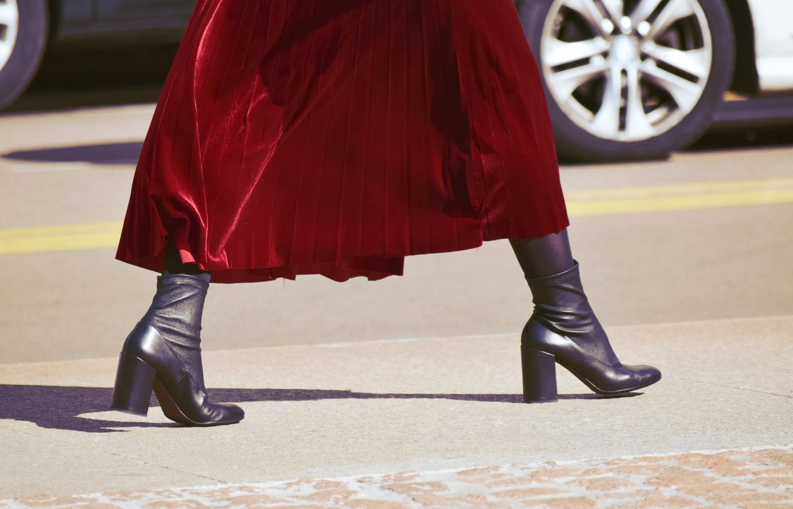

<figure></figure>

*Dieser Beitrag wurde erstmals am 21. März 2023 in englischer Sprache auf [The Beskirted Man](https://www.the-beskirted-man.com/skirts-and-dresses/why-i-wear-skirts-and-heels-or-why-showing-your-feminine-side-makes-you-more-of-a-man/) veröffentlicht.*

In den letzten Jahren ist eine deutliche Feminisierung der Männermode zu beobachten. Männer, die sowohl Röcke als auch Absatzschuhe tragen, sind nicht nur regelmäßig auf den Modenschauen rund um den Globus zu sehen, sondern immer mehr männliche Prominente präsentieren sich im Rampenlicht in Röcken und Absatzschuhen. Obwohl sich dieser Trend in den meisten Gegenden noch nicht auf die Straße verlagert hat, wächst die Community der Männer, die Kleidung tragen, die traditionell mit Frauen assoziiert wird.

Besonders im Internet fällt das auf. Männer, die Kleider, Röcke, Stilettos usw. tragen, tauchen in großer Zahl in den sozialen Medien auf und liegen voll im Trend. Dabei handelt es sich nicht nur um junge Männer – das Spektrum reicht von Teenagern bis hin zu Großvätern. Abgesehen von den sozialen Netzwerken hat auch die Anzahl an Foren und Online-Communities, die sich mit diesem Phänomen beschäftigen, beträchtlich zugenommen – einige davon sind [hier](https://www.the-beskirted-man.com/links/) verlinkt.

Was treibt Männer also dazu? Jeder Mann, den man fragt, wird eine ganz andere Begründung für seine Motivation nennen, was es sehr schwierig macht, den exakten Grund für den derzeitigen Aufschwung dieses Trends zu bestimmen. Zwar kann ich nicht für alle Männer sprechen, doch ich erzähle gern von meinen persönlichen Gründen – von einigen, die ich vermutlich auch mit anderen teile.

Wie ich anfing, Röcke und Absatzschuhe zu tragen
------------------------------------------------

Bevor ich darauf eingehe, warum ich sie trage, möchte ich kurz schildern, wie ich dazu kam. Mein Interesse an Kleidung, die man traditionell mit Frauen in Verbindung bringt, begann mit den High Heels. Ich bin der Typ Mensch, der Dinge selbst erleben möchte. So entstand meine Neugier, wie es wäre, sie zu tragen – und es gab nur einen Weg, diese Neugier zu befriedigen: es selbst auszuprobieren.

Also fand ich ein Paar Absatzstiefel in meiner Größe (46 – keine leichte Aufgabe), bestellte sie und trug sie zu Hause, wenn meine Frau nicht anwesend war. Es dauerte, bis ich den Mut aufbringen konnte, sie meiner Frau zu zeigen (die mich dabei überaus unterstützte), aber darüber schreibe ich ein andermal.

Ich stellte fest, dass ich es liebte, sie zu tragen. Das Tragen der High Heels verlieh mir einen Nervenkitzel, etwas Verbotenes zu tun – obwohl daran absolut nichts „Schlechtes“ war. Meine Neugier war endgültig geweckt, und es dauerte nicht lange, bis ich den ersten Rock bestellte, der zu den Stiefeln passte. Auch diesen trug ich zunächst allein zu Hause, ohne dass meine Frau davon wusste, bis ich den Mut fand, ihn vor ihr zu präsentieren. Wiederum war sie sehr unterstützend und begrüßte es, wie ich die Geschlechternormen infrage stellte.

Von da an wuchs meine Besessenheit – und in gewissem Maße ist es inzwischen nahezu zu einer Obsession geworden. Möglicherweise besitze ich mehr Paar Absatzschuhe in unterschiedlichen Ausführungen als alle Herrenschuhe, die ich jemals hatte. Auch meine Rockkollektion übertrifft bei Weitem die Anzahl der Kleidungsstücke, die ich sonst als Mann besitze.

Ich trage normalerweise keine Kleider (obwohl ich ein paar in meinem Schrank habe!), weil ich finde, dass sie mir nicht wirklich stehen. Sie sind für den weiblichen Körper geschnitten, und bei meiner breiten Brust und meinen kantigen, maskulinen Schultern wirken sie, meiner Meinung nach, merkwürdig an mir. Deshalb kombiniere ich meist Röcke mit einem männlichen Hemd oder Oberteil.

Warum ich feminine Kleidung trage
---------------------------------

Da du nun weißt, wie ich dazu kam, Röcke und Absatzschuhe zu tragen, möchte ich ein wenig darauf eingehen, warum ich es tue. Zunächst wollte ich betonen, dass ich ursprünglich einfach nur aus purer Neugier angefangen habe – das reichte vollkommen als Grund, um auszuprobieren!

Mittlerweile trage ich fast jeden Tag Röcke und Absatzschuhe – möglich gemacht durch die Tatsache, dass ich Vollzeit im Homeoffice arbeite und durch die Unterstützung meiner Frau. Durch das häufige Tragen haben diese Kleidungsstücke für mich eine tiefere Bedeutung gewonnen. Sie sind, so gewissermaßen, zu einem Teil meiner Identität und Ausdrucksweise geworden.

Ich bin fest davon überzeugt, dass jeder Mann eine feminine Seite hat, die aber von den meisten unterdrückt wird. Viele Jungen lernen, sie nicht zu zeigen, sei es durch Spott in der Schule, von älteren Geschwistern oder sogar von den eigenen Vätern. „Du wirfst wie ein Mädchen!“ oder schlicht „Sei kein Mädchen!“ zählen zu den schlimmsten Beschimpfungen auf dem Pausenhof, die einem Jungen eingebläut werden – und sie vermitteln, dass es etwas Negatives sei, eine feminine Seite zu haben.

Durch meine Erfahrung, traditionell feminine Kleidung zu tragen, habe ich gelernt, dass daran absolut nichts falsch ist. Tatsächlich würde ich sogar behaupten, dass es einen noch mehr zu einem Mann macht – darauf gehe ich später noch näher ein.

Ursprünglich nahm ich die feminine Kleidung aus reiner Neugier in Angriff, doch heute trage ich sie, weil ich gelernt habe, diese Seite an mir stolz zu akzeptieren. Für mich ist es ein mutiges Statement, das ablehnt, was mir und anderen Jungen in der Kindheit von Mobbern eintrichtern werden sollte. Es ist auch ein Ausdruck von Selbstvertrauen – ein klares Bekenntnis dazu, glücklich und stolz auf das zu sein, wer ich bin, und mich nicht länger von den Urteilen anderer einschränken zu lassen.

Zum einen ist das der eher philosophische Grund, warum ich sie so liebe. Zum anderen gibt es einen sehr pragmatischen Aspekt: den Komfort. Röcke sind unglaublich bequem! Ein Mann, der noch nie einen Rock ausprobiert hat, verpasst wirklich etwas. Sie sind im Sommer erfrischend kühl und können – kombiniert mit den richtigen Strumpfhosen oder Leggings – im Winter auch für angenehme Wärme sorgen.

Und natürlich dürfen wir nicht vergessen, dass die Möglichkeit, in einem Rock herumzudrehen, allein schon ein guter Grund ist, ihn regelmäßig zu tragen!

Warum das Tragen femininer Kleidung dich zu einem besseren Mann macht
---------------------------------------------------------------------

Es mag kontraintuitiv erscheinen, zu behaupten, dass das Tragen femininer Kleidung einen Mann noch mehr zu einem Mann macht, aber es gibt zahlreiche Gründe, warum dem so ist.

Zunächst einmal bedeutet es, dass du in deinem Innersten mehr mit dir selbst in Kontakt bist. Wenn du keine Angst vor deiner femininen Seite hast, wird aus dir ein ausgeglichenerer Mensch – du befreist einen Teil deiner Persönlichkeit aus seinem Käfig. Menschen sind komplex und facettenreich, doch die Gesellschaft lehrt uns oft, gewisse Aspekte unserer Persönlichkeit zu verstecken, weil sie als gesellschaftlich nicht akzeptabel gelten. Viele Männer fürchten ihre feminine Seite, weil sie von anderen darauf konditioniert wurden, diese zu unterdrücken.

Ein weiterer Grund, warum es dich zu einem besseren Mann macht, ist dein Mut dazu. Du wagst es, gegen den Strom zu schwimmen und das zu erkunden, was die Gesellschaft noch als unnormal betrachtet. Wenn man darüber spricht, was als typisch männlich oder weiblich gilt, gehört es schon zu den markant maskulinen Eigenschaften, sich nicht darum zu kümmern, was andere denken, und den eigenen Weg zu gehen. Zwar stimme ich dieser Sichtweise nicht in allen Punkten uneingeschränkt zu, doch sie wird oft als typisch männlich beschrieben: Ein echter Mann tut, was er will, wann er will – ohne sich von der Meinung anderer einschränken zu lassen.

Auch sollte nicht unerwähnt bleiben, dass ein echter Mann auf sein Erscheinungsbild achtet. Es wäre schwierig, einen Partner zu finden, einen Geschäftsabschluss zu erzielen oder andere typische „männliche“ Ziele zu erreichen, wenn man sich schlampig kleidet. Das Tragen von Röcken, Kleidern, Absatzschuhen usw. eröffnet völlig neue Möglichkeiten, die eigene Garderobe zu bereichern – gerade weil die Herrenschränke in der Modewelt oft recht begrenzt und eintönig sind. Indem du typischerweise feminine Kleidung in deinen Stil integrierst, kannst du deinem Aussehen mehr Vielfalt verleihen und einen frischen Look kreieren, den andere nicht haben. Genau das versuchen derzeit die Laufstege von Paris bis New York zu erreichen – und es verschafft dir wirklich einen Vorsprung und lässt dich herausstechen.

Fazit
-----

Es gibt zahllose Gründe, als Mann Kleidung zu tragen, die traditionell als feminin gilt. Deine Gründe mögen von meinen abweichen – und das ist vollkommen in Ordnung. Die Kleidung, die wir wählen, ist zutiefst persönlich, und jeder sollte seinen eigenen Beweggrund haben.

Gegen den vorherrschenden Strom zu schwimmen ist nicht einfach, aber es lohnt sich auf jeden Fall. Jeder, der in dieser Welt etwas bewirkt hat, ist in irgendeiner Weise aus der Reihe gefallen und hat sich gegen die Erwartungen der Gesellschaft gestellt. Selbst wenn das Tragen von Kleidung, die man bei Männern nicht gewohnt ist, nur in deinem lokalen Umfeld oder Freundeskreis einen Unterschied macht, hast du dennoch etwas bewirkt und die Sichtweisen anderer in Frage gestellt – und das ist definitiv anerkennenswert.

*Habe ich irgendwelche Gründe ausgelassen, warum das Tragen femininer Kleidung einen Mann noch mehr zu einem Mann macht? Möchtest du deine Gründe, warum du feminine Kleidung trägst, teilen? Hinterlasse gerne einen Kommentar unten!*