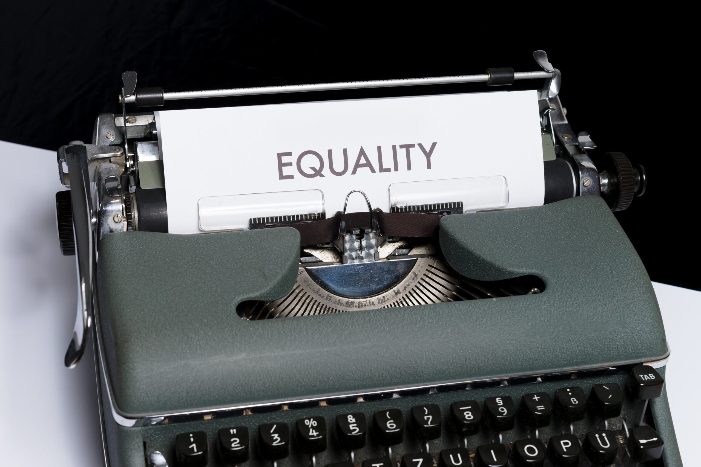

<figure></figure>

*Dieser Beitrag wurde erstmals am 13. August 2023 in englischer Sprache auf [The Beskirted Man](https://www.the-beskirted-man.com/general/what-does-promoting-femininity-in-masculinity-actually-mean/) veröffentlicht.*

Seit ich *[The Beskirted Man](https://www.the-beskirted-man.com)* ins Leben gerufen habe, wurde ich schon mehrfach gefragt, was genau ich mit dem Slogan „Feminität in der Männlichkeit fördern“ meine. Ich habe die Frage bereits in kürzeren Antworten beantwortet, aber ich dachte, es wäre lohnenswert, eine längere, detailliertere Antwort zu verfassen.

Auf den ersten Blick scheint sich dieser Blog um nicht traditionelle, nicht genderkonforme Mode für Männer zu drehen. Obwohl dies zweifellos das Hauptthema ist, geht der dahinterstehende Zweck weit darüber hinaus.

Feminität ist ein Teil der Männlichkeit
---------------------------------------

Durch die symbolische Verwendung von Kleidung verfolge ich das Ziel, die Idee zu verbreiten, dass Männlichkeit und Feminität untrennbar miteinander verbunden sind und dass Männer einige ihrer eher „weiblichen“ Eigenschaften annehmen sollten.

Beispiele für solche Eigenschaften sind emotionale Verletzlichkeit, Sanftheit und Zärtlichkeit, Sensibilität, Passivität und Ähnliches. Diese Eigenschaften werden von der westlichen Gesellschaft meist Frauen zugeschrieben, wodurch Männer, die etwa Zärtlichkeit oder Sensibilität zeigen, oft als schwach und „unmännlich“ abgestempelt werden.

Nach westlichen Maßstäben sollte ein wahrer Mann aggressiv sein und sich nicht mit anderen Emotionen als Glück und Wut beschäftigen. Alles wird als schwarz oder weiß bewertet, ohne Raum für Nuancen. Das ist toxische Männlichkeit, und viele Männer leiden unter dem Druck, diesen Erwartungen gerecht zu werden.

Wahre Männlichkeit hingegen umfasst alle Facetten, die ein Mann zu bieten hat. Wenn ein Mann weinen muss, weil sein geliebter Hamster krank ist, dann sollte es ihm erlaubt sein, dies zu tun und in jenem Moment verletzlich zu sein — frei von jeglicher Bewertung. Ein wahrer Mann akzeptiert alle Aspekte seiner Persönlichkeit, unabhängig davon, was als „weiblich“ oder „männlich“ gilt, und scheut sich nicht, diese zu zeigen.

Warum zwischen „weiblich“ und „männlich“ unterscheiden?
-------------------------------------------------------

Ich setze die Begriffe „weiblich“ und „männlich“ in Anführungszeichen, weil wir uns die Frage stellen müssen, was sie eigentlich bedeuten. Wenn eine Person beide Eigenschaften in sich trägt, warum sollte dann unterschieden werden?

Die Antwort darauf liegt leider weitgehend außerhalb der individuellen Kontrolle. Die Gesellschaft differenziert die beiden von ihr definierten Geschlechter auf vielfältige Weise — etwa durch Kleidung und charakterliche Merkmale. Daher ist es weiterhin notwendig, diese Nomenklatur zu verwenden, damit klar wird, was gemeint ist.

Bei der Beschreibung von Eigenschaften handelt es sich um eine oberflächliche Unterteilung, die in Wirklichkeit nicht existieren sollte. Sowohl Männer als auch Frauen besitzen eine Fülle von Eigenschaften, die in beide Kategorien eingeordnet werden, obwohl das eigentlich keinen Sinn ergibt. Man sollte seine Eigenschaften einfach annehmen und sich nicht darum kümmern, ob sie als „männlich“ oder „weiblich“ gelten.

Ein Kleidungsstück als „männlich“ oder „weiblich“ zu bezeichnen, mag in einigen Fällen, etwa hinsichtlich des Schnitts, sinnvoll erscheinen, trifft aber nicht immer zu. Ich würde sogar dafür plädieren, diese Art der Beschreibung ganz aufzugeben und stattdessen neue Wege zu finden, um den Schnitt eines Kleidungsstücks zu beschreiben. Dabei sollte man sich eher an Körpertypen als am Geschlecht orientieren.

Jedes Kleidungsstück, jedes Muster, jedes Material usw. sollte geschlechtsneutral sein und allen zur Verfügung stehen. Auch Schuhe, einschließlich Absatzschuhen, sollten in allen Größen und Breiten erhältlich sein, ohne als „männlich“ oder „weiblich“ etikettiert zu werden.

Jeder sollte sich nicht nur in der Wahl der Kleidung frei fühlen dürfen, sondern auch in der Entfaltung von Persönlichkeitsmerkmalen, die gesellschaftlich einem bestimmten Geschlecht zugeordnet werden. Aber warum ist das nicht der Fall?

Mobbing und Selbstunterdrückung
-------------------------------

Der Titel fasst die Antwort auf diese Frage prägnant zusammen. Die Vorstellung, dass „Männlichkeit“ und „Feminität“ zwei getrennte Konzepte sind, wurde uns von klein auf buchstäblich eingetrichtert und begleitet uns ein Leben lang.

Hänseleien auf dem Schulhof, engstirnige Familienmitglieder und der Druck, in der Schule „cool“ zu sein, zwingen Individuen dazu, sich so lange der Mehrheit anzupassen, bis es zur Norm wird. Jungen werden nicht mit einer Abneigung gegen das Tragen von Kleidern oder gegen das Weinen geboren — sie werden dazu erzogen.

Auch im Erwachsenenalter setzt sich dieses Mobbing fort. Ein Mann, der es wagt, ein Kleid mit Blumenmuster in der Öffentlichkeit zu tragen, läuft Gefahr, von anderen verspottet zu werden, die so engstirnig sind, dass sie nicht einmal in Betracht ziehen, warum es nicht „normal“ ist. Auch wenn so etwas in der Realität sehr selten vorkommt, reicht allein die Angst davor oft aus, um die meisten Männer davon abzuhalten, die gerne nicht genderkonforme Kleidung tragen würden.

Diskriminierung und Zwang sind weitere Methoden, mit denen sich Erwachsene gegenseitig in vorgefertigte Rollen drängen. Ein hervorragendes Beispiel dafür findet sich am Arbeitsplatz. Viele Unternehmen setzen ihren Mitarbeitern einen Dresscode auf, der Männern das Tragen von Röcken oder Kleidern untersagt, weil man dies als „unprofessionell“ betrachtet. Warum sollte es für Männer unprofessionell sein, sie zu tragen, während es bei weiblichen Mitarbeitern in Ordnung ist?

Dasselbe gilt, wenn Männer ihre „weiblichen“ Eigenschaften zeigen. Außer bei einer echten Tragödie ist es äußerst selten, einen Mann in der Öffentlichkeit vor Rührung in Tränen ausbrechen zu sehen. Niemand würde überrascht reagieren, wenn eine Frau vor Freude weint, weil ihr gerade ein Heiratsantrag gemacht wurde, aber tut ein Mann dasselbe, würden die Menschen ihn seltsam mustern.

Diese Art der Selbstunterdrückung bedeutet, dass Menschen gezwungen werden oder sich gezwungen fühlen, einen Teil ihrer selbst zu verbergen. Dadurch ersticken sie im Grunde einen Teil ihrer Persönlichkeit und das ist in keiner Weise gesund.

Welche Rolle spielt Kleidung?
-----------------------------

Zu Beginn des Artikels erwähnte ich, dass ich die Symbolik der Kleidung nutze, um die Idee der „Feminität in der Männlichkeit“ zu fördern. Das liegt daran, dass Kleidung oft unterschätzt wird, wenn es darum geht, die eigene Identität auszudrücken. Menschen, die sich auf eine von der Gesellschaft als exzentrisch empfundene Weise kleiden, ganz unabhängig davon, ob das genderkonform ist oder nicht, betonen häufig, dass sie sich so ausdrücken wollen.

Aus meiner persönlichen Erfahrung mit dem Tragen von Röcken und Absatzschuhen kann ich nur dasselbe sagen. Wenn ich beispielsweise gezwungen bin, Jeans anstelle eines Rocks zu tragen, weil ich meine ultrakonservativen Verwandten im ländlichen Deep South der Vereinigten Staaten besuche, habe ich das Gefühl, nicht meinem wahren Selbst gerecht zu werden, als spielte ich eine vorgefertigte Rolle, die in vielerlei Hinsicht nichts mit dem zu tun hat, wer ich wirklich bin.

Durch den bewussten Einsatz von Kleidung lehne ich die Schubladen ab, in die mich Außenstehende stecken und von denen sie erwarten, dass ich mich anpasse. Wenn ich einen Rock trage, habe ich das Gefühl, mein wahres Selbst anzunehmen und zu präsentieren, was meinem Selbstvertrauen, selbst in der Öffentlichkeit, einen enormen Schub verleiht. Es zeigt, wie stolz ich auf mein gesamtes Wesen bin, einschließlich der eher „weiblichen“ Seiten meiner Persönlichkeit.

Fazit
-----

Der Punkt, den ich mit diesem Geschwafel machen möchte, ist, dass es so etwas wie „männliche“ oder „weibliche“ Eigenschaften eigentlich gar nicht gibt. Es handelt sich dabei um künstliche Etiketten, die nur einen Teil der Eigenschaften beschreiben, und jede einzelne Person auf diesem Planeten besitzt eine einzigartige Mischung davon.

Viele von uns unterdrücken einige oder alle Eigenschaften, die als typisch für ein Geschlecht gelten, mit dem wir uns nicht identifizieren — ich selbst bin darin bis heute sicherlich schuldig. Wer das tut, unterdrückt einen Teil seiner eigenen Persönlichkeit und bleibt somit seinen Liebsten und sich selbst gegenüber unehrlich.

Kleidung spielt dabei eine wesentliche Rolle, da sie eine sofortige visuelle Trennung zwischen „Männlichkeit“ und „Feminität“ aufrechterhält — ein ständiger, teils sogar unbewusster Reminder, wann immer wir jemanden oder uns selbst sehen. Das Tragen von nicht genderkonformer Kleidung ist ein Weg, diese Stereotypen aufzubrechen und anderen zu zeigen, dass man dazu steht, unabhängig von den gesellschaftlichen Labels seinem wahren Selbst treu zu sein.

*Wie stehst du zur gesellschaftlichen Trennung von „männlich“ und „weiblich“? Welche Erfahrungen hast du damit gemacht, dich einer der beiden Rollen anzupassen? Unternimmst du etwas, um aus dieser Schablone auszubrechen? Falls ja, was tust du? Lass es uns in den Kommentaren wissen!*