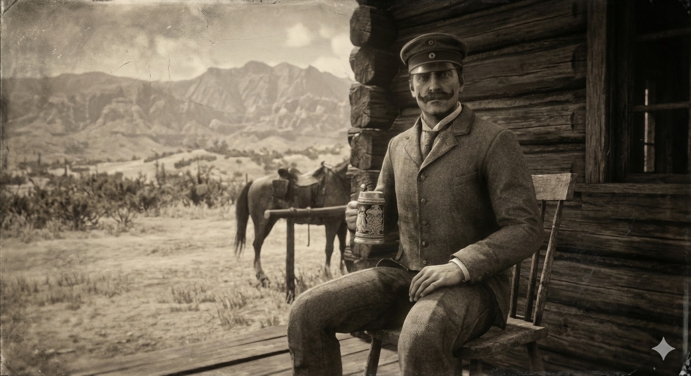

<figure><figcaption>KI-generiertes Bild eines deutschen Adeligen im amerikanischen Wilden Westen</figcaption></figure>

Vor ein paar Tagen habe ich einen [Beitrag über den britischen Adel im amerikanischen Wilden Westen](https://blog.alexseifert.com/2026/02/06/top-hats-tumbleweeds-when-british-aristocrats-wandered-into-the-american-west/) auf meinem englischsprachigen Blog *[Alex’s Notebook](https://blog.alexseifert.com)* veröffentlicht. Dadurch kam ich auf die Frage, wie es wohl für den deutschen Adel im Wilden Westen gewesen ist. Informationen darüber zu finden war deutlich schwieriger als beim britischen Adel, aber ein paar interessante Beispiele habe ich trotzdem entdeckt.

Es gibt historische Episoden, die so herrlich unwahrscheinlich wirken, dass man sie fast für literarische Übertreibungen hält. Deutsche Aristokraten im amerikanischen Wilden Westen gehören definitiv dazu. Man stellt sich ja gern einen preußischen Grafen vor, wie er mit strengem Blick seine Ländereien inspiziert — aber weniger, wie derselbe Graf in Montana versucht, ein widerspenstiges Pferd davon zu überzeugen, dass *er* hier der Adel ist.

Und doch: Sie kamen. Mit Titeln, Taktstock‑Mentalität und einer bemerkenswerten Bereitschaft, sich in Situationen zu begeben, die ihre Gouvernanten ihnen ausdrücklich verboten hätten.

Der Westen als Fluchtpunkt für Überzählige
------------------------------------------

Der deutsche Adel des 19. Jahrhunderts war ein streng geordnetes System. Erstgeborene erbten. Zweitgeborene gingen ins Militär. Drittgeborene wurden Diplomaten oder Theologen. Viertgeborene… nun ja, die wurden oft einfach übersehen. Der amerikanische Westen bot da eine willkommene Alternative: ein Ort, an dem niemand fragte, ob man ein „von“ im Namen hatte und an dem es völlig egal war, ob man wusste, wie man eine Tischordnung erstellt.

Viele junge Adlige reisten aus Abenteuerlust. Andere aus Langeweile. Wieder andere, weil sie in Europa ein paar zu viele Schulden oder Affären angesammelt hatten. Der Westen war weit genug weg, um all das zu vergessen — und chaotisch genug, um niemanden zu interessieren.

Kulturkollisionen in Staub und Stiefeln
---------------------------------------

Der erste Schock traf die Garderobe. Deutsche Aristokraten reisten gern mit:

-   maßgeschneiderten Reitstiefeln
-   Uniformjacken, die mehr Knöpfe hatten als ein Klavier
-   Hüten, die eher für Paraden als für Präriewinde geeignet waren

Die Cowboys beobachteten diese Erscheinungen mit einer Mischung aus Faszination und stillem Mitleid. Ein Zeitungsbericht aus Kansas beschrieb einen deutschen Baron als „höflich, gut erzogen und völlig ungeeignet für jedes Tier, das mehr als zwei Beine hat“.

Historische Figuren, die tatsächlich dort waren
-----------------------------------------------

Es gab einige Deutsche, die den amerikanischen Wilden Westen besucht oder sich dort niedergelassen haben, aber es war erstaunlich schwierig, Informationen über deutsche Adlige zu finden. Nichtsdestotrotz konnte ich ein paar Figuren ausfindig machen.

### Prinz Maximilian zu Wied — Der Naturforscher, der den Westen dokumentierte

Maximilian zu Wied-Neuwied reiste 1832–1834 durch die amerikanische Frontier, begleitet vom Schweizer Maler Karl Bodmer. Er war kein typischer „Wildwest‑Abenteurer“, sondern ein wissenschaftlich motivierter Aristokrat, der Flora, Fauna und indigene Kulturen dokumentierte. Seine Reiseberichte gehören heute zu den wichtigsten ethnografischen Quellen des 19. Jahrhunderts.

Er war allerdings auch ein Mann, der höflich versuchte, Büffelherden auszuweichen, während Bodmer verzweifelt versuchte, sie zu malen, bevor sie wieder verschwanden.

### Herzog Paul von Württemberg — Der Adlige, der lieber mit Bären sprach als mit Diplomaten

Paul von Württemberg, ein exzentrischer Naturforscher und Mitglied des württembergischen Königshauses, reiste in den 1820ern durch die Rocky Mountains. Er war bekannt dafür, dass er:

-   wissenschaftliche Proben sammelte
-   sich mit Trappern anfreundete
-   und angeblich versuchte, einen Bären zu zähmen (was erwartungsgemäß scheiterte)

Seine Berichte zeigen eine Mischung aus echter Neugier und aristokratischer Selbstüberschätzung — eine Kombination, die im Westen erstaunlich gut funktionierte.

### Baron Friedrich Wilhelm von Egloffstein — Der Kartograf, der fast verdurstete

Egloffstein nahm 1853 an der berühmten „Pacific Railroad Survey“ teil, einer Expedition zur Vermessung möglicher Eisenbahnstrecken. Er war ein talentierter Zeichner und Kartograf, aber weniger talentiert im Umgang mit Wüstenklima. Sein Tagebuch erwähnt mehrfach, dass er „den Zustand der Zivilisation“ vermisse und dass Kakteen „eine Beleidigung für jeden anständigen Wald“ seien.

Seine Karten wurden später im US‑Kongress präsentiert, was vermutlich das erste und letzte Mal war, dass ein deutscher Baron unfreiwillig amerikanische Infrastrukturpolitik beeinflusste.

### Lernen unter erschwerten Bedingungen

Viele deutsche Adlige lernten schnell, dass der Westen nicht auf höfische Etikette reagierte. Pferde kümmerten sich nicht um Titel. Büffel ignorierten höfliche Anreden. Und Cowboys hatten wenig Geduld für jemanden, der versuchte, ein Lagerfeuer mit philosophischen Zitaten zu eröffnen.

Trotzdem passten sich einige erstaunlich gut an. Manche wurden respektierte Jäger oder Scouts. Andere betrieben Handelsposten. Wieder andere schrieben Reiseberichte, die heute wertvolle historische Quellen sind.

Und dann gab es jene, die nach zwei Wochen feststellten, dass sie den Komfort ihrer Schlösser doch sehr vermissten und schnellstmöglich zurückkehrten.

### Deutsche Gewohnheiten, die den Westen nicht beeindruckten

Einige aristokratische Rituale überlebten den Atlantik, allerdings nicht immer unbeschadet:

-   Ein Graf aus Hessen soll versucht haben, eine Jagdgesellschaft nach europäischem Vorbild zu organisieren — inklusive Hörnern und roten Jacken. Die Pferde verweigerten die Teilnahme.
-   Ein preußischer Offizier bestand auf morgendlichen Exerzierübungen. Die Cowboys lachten so lange, bis er aufgab.
-   Mehrere Adlige versuchten, Bier zu brauen. Die Ergebnisse wurden von Zeitzeugen als „mutig, aber untrinkbar“ beschrieben.

### Fazit

Heute wirken diese Geschichten wie eine Mischung aus Abenteuerroman und Kultursatire. Sie zeigen, wie absurd und gleichzeitig menschlich es ist, wenn Menschen versuchen, sich neu zu erfinden — besonders in einer Umgebung, die keinerlei Respekt vor ihren alten Rollen hat.

Der deutsche Adel im Wilden Westen ist ein wunderbares Beispiel dafür, dass Identität manchmal erst dann sichtbar wird, wenn man sie gegen eine völlig fremde Welt hält. Manchmal entsteht daraus ein neues Selbst. Manchmal nur ein sehr verwirrtes Pferd.

Aber in jedem Fall entsteht eine Geschichte, die es wert ist, erzählt zu werden.